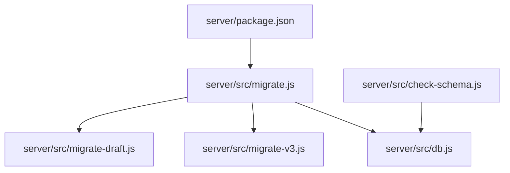
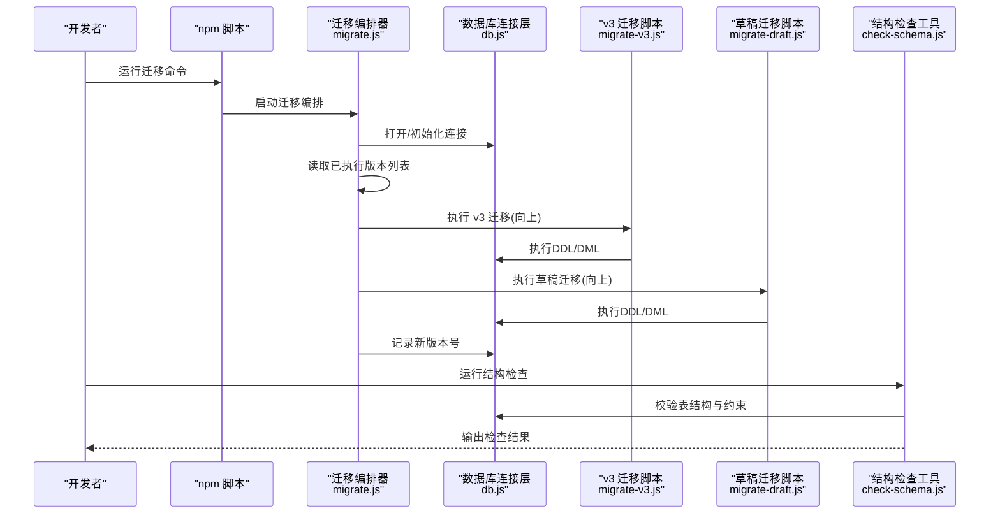
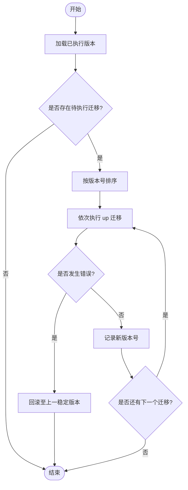
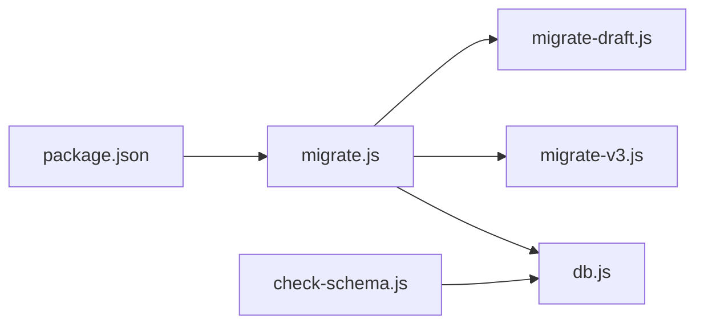

# 数据库迁移管理

<cite>
**本文引用的文件**   
- [server/src/db.js](file://server/src/db.js)
- [server/src/migrate.js](file://server/src/migrate.js)
- [server/src/migrate-v3.js](file://server/src/migrate-v3.js)
- [server/src/migrate-draft.js](file://server/src/migrate-draft.js)
- [server/src/check-schema.js](file://server/src/check-schema.js)
- [server/package.json](file://server/package.json)
</cite>

## 目录
1. [简介](#简介)
2. [项目结构](#项目结构)
3. [核心组件](#核心组件)
4. [架构总览](#架构总览)
5. [详细组件分析](#详细组件分析)
6. [依赖关系分析](#依赖关系分析)
7. [性能考虑](#性能考虑)
8. [故障排查指南](#故障排查指南)
9. [结论](#结论)
10. [附录](#附录)

## 简介
本文件面向后端数据库迁移管理，聚焦版本控制与数据同步机制。内容涵盖：
- 迁移文件的命名规范与结构定义（版本号、依赖关系）
- 迁移执行流程（增量更新、回滚策略、数据验证）
- 最佳实践（向后兼容、数据备份、错误处理）
- 迁移脚本编写指南（CRUD、数据转换、批量处理）
- 具体示例与常见问题解决方案

## 项目结构
本项目在后端 server 目录下提供迁移相关脚本与工具，主要涉及：
- 数据库连接与初始化
- 迁移编排器与多版本迁移脚本
- 数据校验与检查工具
- 包管理与脚本入口

图表来源
- [server/package.json](file://server/package.json)
- [server/src/migrate.js](file://server/src/migrate.js)
- [server/src/db.js](file://server/src/db.js)
- [server/src/migrate-v3.js](file://server/src/migrate-v3.js)
- [server/src/migrate-draft.js](file://server/src/migrate-draft.js)
- [server/src/check-schema.js](file://server/src/check-schema.js)

章节来源
- [server/src/db.js](file://server/src/db.js)
- [server/src/migrate.js](file://server/src/migrate.js)
- [server/src/migrate-v3.js](file://server/src/migrate-v3.js)
- [server/src/migrate-draft.js](file://server/src/migrate-draft.js)
- [server/src/check-schema.js](file://server/src/check-schema.js)
- [server/package.json](file://server/package.json)

## 核心组件
- 数据库连接层：负责 SQLite 连接、事务与基础查询封装，为迁移脚本提供统一访问能力。
- 迁移编排器：按版本顺序加载并执行迁移脚本，记录已执行版本，支持幂等与失败回滚。
- 版本化迁移脚本：每个迁移对应一个独立文件，包含 up（向前）与 down（回滚）逻辑。
- 数据校验工具：用于在迁移前后对表结构与数据进行一致性检查。

章节来源
- [server/src/db.js](file://server/src/db.js)
- [server/src/migrate.js](file://server/src/migrate.js)
- [server/src/migrate-v3.js](file://server/src/migrate-v3.js)
- [server/src/migrate-draft.js](file://server/src/migrate-draft.js)
- [server/src/check-schema.js](file://server/src/check-schema.js)

## 架构总览
迁移系统采用“编排器 + 版本脚本”的轻量方案，通过统一的数据库连接层执行 SQL 与数据操作，确保迁移可追踪、可回滚、可验证。

图表来源
- [server/src/migrate.js](file://server/src/migrate.js)
- [server/src/db.js](file://server/src/db.js)
- [server/src/migrate-v3.js](file://server/src/migrate-v3.js)
- [server/src/migrate-draft.js](file://server/src/migrate-draft.js)
- [server/src/check-schema.js](file://server/src/check-schema.js)

## 详细组件分析

### 数据库连接层（db.js）
职责与要点：
- 建立 SQLite 连接，提供事务、查询与批处理方法
- 保证迁移过程中的原子性与一致性
- 暴露统一的错误类型与日志接口，便于诊断

建议用法：
- 所有 DDL/DML 均通过该层执行
- 长耗时任务使用事务包裹，避免部分成功导致状态不一致

章节来源
- [server/src/db.js](file://server/src/db.js)

### 迁移编排器（migrate.js）
职责与要点：
- 维护已执行版本清单，确保幂等执行
- 按版本号升序执行未执行的迁移脚本
- 支持失败时回滚到上一个稳定版本
- 提供迁移状态查询与校验钩子

执行流程（简化）：

图表来源
- [server/src/migrate.js](file://server/src/migrate.js)

章节来源
- [server/src/migrate.js](file://server/src/migrate.js)

### 版本化迁移脚本（migrate-v3.js、migrate-draft.js）
命名与结构约定：
- 文件名以语义化版本号或描述性前缀标识，如 v3、draft
- 每个脚本需实现 up（向前）与 down（回滚）两个方法
- up 中仅做必要变更；down 中应完全撤销 up 的影响

依赖关系：
- 迁移脚本之间应保持无环依赖，必要时通过编排器保证执行顺序
- 若存在跨脚本依赖，应在编排器中显式声明顺序

章节来源
- [server/src/migrate-v3.js](file://server/src/migrate-v3.js)
- [server/src/migrate-draft.js](file://server/src/migrate-draft.js)

### 数据校验工具（check-schema.js）
职责与要点：
- 在迁移后对关键表结构、索引与约束进行校验
- 对比期望模式与实际模式，输出差异报告
- 可作为 CI 门禁步骤，防止不合规迁移上线

章节来源
- [server/src/check-schema.js](file://server/src/check-schema.js)

## 依赖关系分析
- 编排器依赖数据库连接层
- 各版本迁移脚本依赖数据库连接层
- 校验工具依赖数据库连接层
- 包管理脚本作为入口触发编排器与校验工具

图表来源
- [server/package.json](file://server/package.json)
- [server/src/migrate.js](file://server/src/migrate.js)
- [server/src/db.js](file://server/src/db.js)
- [server/src/migrate-v3.js](file://server/src/migrate-v3.js)
- [server/src/migrate-draft.js](file://server/src/migrate-draft.js)
- [server/src/check-schema.js](file://server/src/check-schema.js)

章节来源
- [server/package.json](file://server/package.json)
- [server/src/migrate.js](file://server/src/migrate.js)
- [server/src/db.js](file://server/src/db.js)
- [server/src/migrate-v3.js](file://server/src/migrate-v3.js)
- [server/src/migrate-draft.js](file://server/src/migrate-draft.js)
- [server/src/check-schema.js](file://server/src/check-schema.js)

## 性能考虑
- 大表变更优先使用在线 DDL 策略（如分阶段添加列、重建索引），减少锁表时间
- 批量数据更新分批提交，避免单次事务过大
- 迁移过程中关闭不必要的日志与监控探针，降低 I/O 压力
- 对热点表变更尽量安排在低峰期执行

## 故障排查指南
- 迁移失败定位
  - 查看编排器日志与错误堆栈，确认失败的具体迁移与语句
  - 使用校验工具比对当前结构与期望结构，快速发现缺失字段或索引
- 回滚问题
  - 确认 down 方法是否完整撤销 up 的影响
  - 对于不可逆变更，需在 down 中提供安全降级路径或人工干预指引
- 数据一致性问题
  - 在迁移前后增加快照与校验点
  - 对关键字段设置默认值与约束，避免脏数据扩散

章节来源
- [server/src/migrate.js](file://server/src/migrate.js)
- [server/src/check-schema.js](file://server/src/check-schema.js)

## 结论
本迁移体系以“编排器 + 版本脚本 + 校验工具”为核心，结合事务与幂等设计，实现了可追踪、可回滚、可验证的数据演进流程。遵循本文的命名规范、执行策略与最佳实践，可在保障业务连续性的同时，稳步推进数据库结构的迭代。

## 附录

### 迁移文件命名规范与结构定义
- 命名规范
  - 使用语义化版本号或清晰描述前缀，例如 v3、draft
  - 同一主版本内可按序号递增，确保严格有序
- 结构定义
  - 每个迁移文件必须导出 up 与 down 两个方法
  - up 负责向前变更；down 负责回滚撤销
  - 如需依赖其他迁移，请在编排器中声明顺序，避免循环依赖

章节来源
- [server/src/migrate-v3.js](file://server/src/migrate-v3.js)
- [server/src/migrate-draft.js](file://server/src/migrate-draft.js)
- [server/src/migrate.js](file://server/src/migrate.js)

### 迁移执行流程（增量更新、回滚策略、数据验证）
- 增量更新
  - 编排器读取已执行版本，仅执行未执行的迁移
  - 按版本号升序执行，确保依赖顺序正确
- 回滚策略
  - 失败时自动回滚至上一稳定版本
  - 手动回滚需调用对应迁移的 down 方法，并确保幂等
- 数据验证
  - 迁移完成后运行校验工具，核对表结构、索引与约束
  - 对关键业务数据执行抽样校验，确保数据完整性

章节来源
- [server/src/migrate.js](file://server/src/migrate.js)
- [server/src/check-schema.js](file://server/src/check-schema.js)

### 数据迁移最佳实践
- 向后兼容性
  - 新增字段设置合理默认值，避免破坏旧代码路径
  - 删除字段前先标记废弃，观察一段时间后再移除
- 数据备份
  - 执行迁移前对关键表进行快照或导出
  - 保留最近一次成功迁移后的备份，便于快速恢复
- 错误处理
  - 所有 DDL/DML 置于事务中，失败即回滚
  - 记录详细的错误上下文（SQL、参数、行号）

章节来源
- [server/src/db.js](file://server/src/db.js)
- [server/src/migrate.js](file://server/src/migrate.js)

### 迁移脚本编写指南
- CRUD 操作
  - 使用连接层提供的查询与写入方法，避免直接拼接 SQL
  - 对批量写入使用分批提交，控制事务大小
- 数据转换
  - 先写新字段，再逐步迁移数据，最后切换读路径
  - 对历史数据清洗时，增加重试与跳过机制，避免中断
- 批量处理
  - 将大数据集切分为固定大小的批次
  - 每批提交后记录进度，支持断点续跑

章节来源
- [server/src/db.js](file://server/src/db.js)
- [server/src/migrate-v3.js](file://server/src/migrate-v3.js)
- [server/src/migrate-draft.js](file://server/src/migrate-draft.js)

### 具体迁移示例与常见问题
- 示例参考
  - 版本 v3 迁移：[server/src/migrate-v3.js](file://server/src/migrate-v3.js)
  - 草稿迁移：[server/src/migrate-draft.js](file://server/src/migrate-draft.js)
- 常见问题
  - 迁移重复执行：确保编排器记录已执行版本，并在 up 中做幂等判断
  - 回滚不完整：完善 down 方法，覆盖所有 up 的副作用
  - 校验失败：根据 check-schema 输出修复结构差异，重新执行迁移

章节来源
- [server/src/migrate-v3.js](file://server/src/migrate-v3.js)
- [server/src/migrate-draft.js](file://server/src/migrate-draft.js)
- [server/src/check-schema.js](file://server/src/check-schema.js)