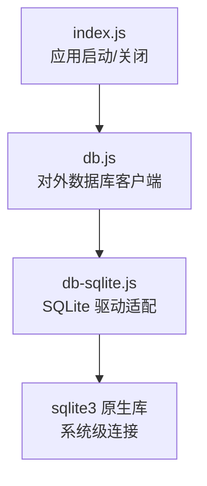
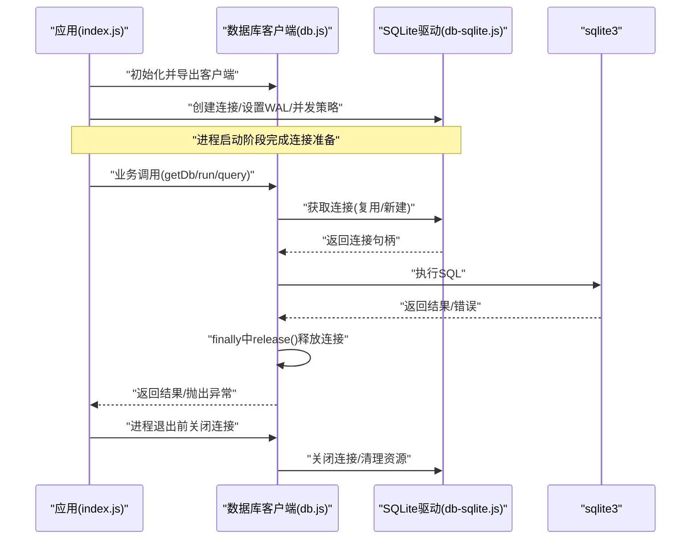
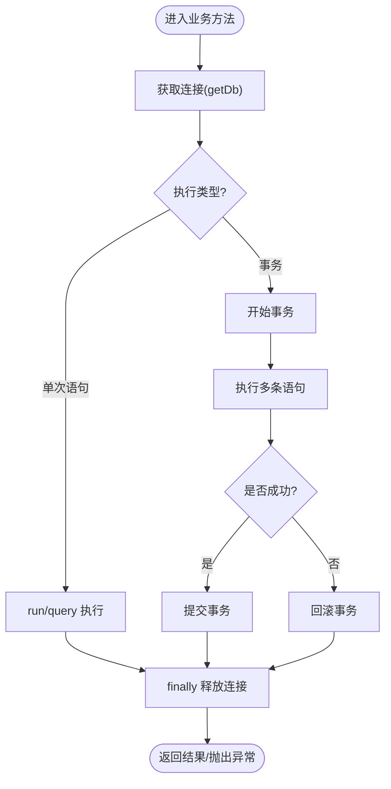
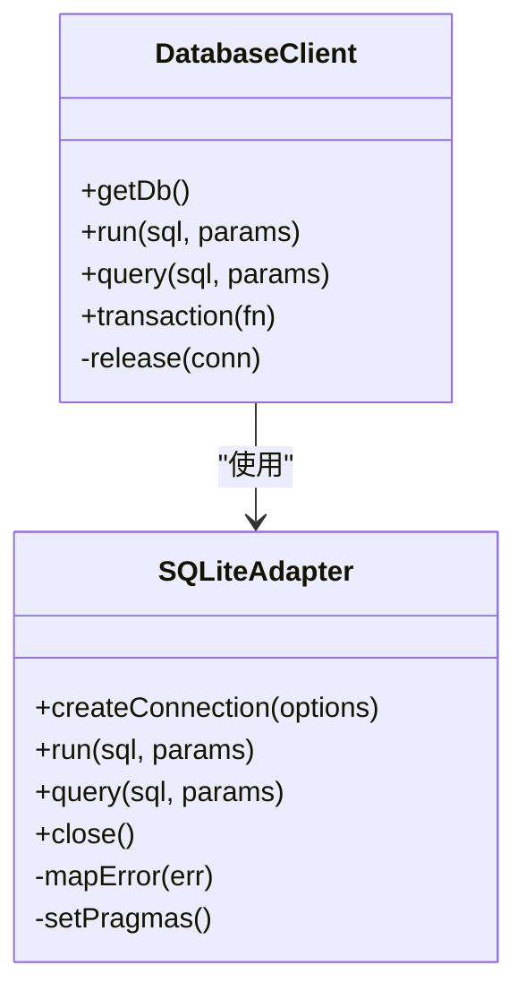
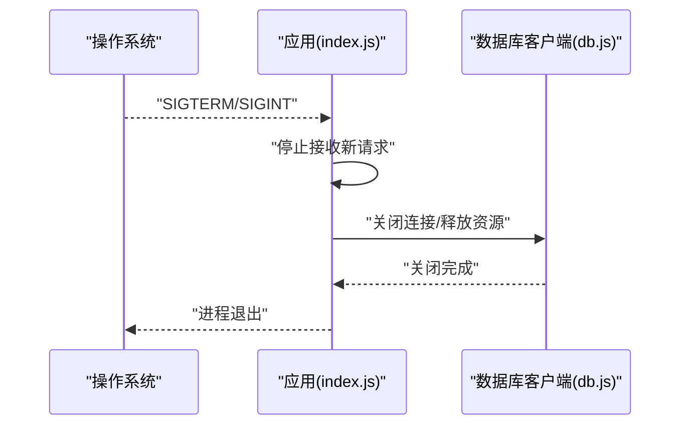
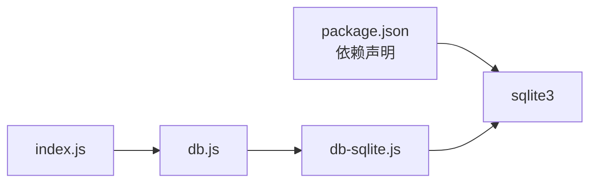

# 数据库连接管理

<cite>
**本文引用的文件**   
- [server/src/db.js](file://server/src/db.js)
- [server/src/db-sqlite.js](file://server/src/db-sqlite.js)
- [server/src/index.js](file://server/src/index.js)
- [server/package.json](file://server/package.json)
</cite>

## 目录
1. [简介](#简介)
2. [项目结构](#项目结构)
3. [核心组件](#核心组件)
4. [架构总览](#架构总览)
5. [详细组件分析](#详细组件分析)
6. [依赖分析](#依赖分析)
7. [性能考虑](#性能考虑)
8. [故障排查指南](#故障排查指南)
9. [结论](#结论)
10. [附录](#附录)

## 简介
本文件面向后端服务中的 SQLite 数据库连接管理，围绕以下目标展开：
- 配置与实现：说明 SQLite 连接的初始化、参数与路径配置。
- 连接池设计模式：解释连接复用、超时处理与故障恢复机制的设计思路。
- 生命周期管理：描述连接建立、维护与关闭流程。
- 错误处理策略：涵盖连接失败重试、异常捕获与日志记录。
- 性能优化建议：包括连接数配置、内存使用与查询缓存。
- 使用示例：给出正确获取与释放连接的实践步骤（以代码片段路径引用代替具体代码）。

## 项目结构
本项目在后端 server 目录下提供 SQLite 连接相关实现，关键文件如下：
- db.js：对外暴露的数据库客户端封装，负责连接获取、事务执行与资源释放。
- db-sqlite.js：SQLite 驱动适配层，封装底层 sqlite3 调用与连接创建。
- index.js：应用启动入口，负责初始化数据库连接并在进程退出时优雅关闭。
- package.json：声明 sqlite3 等运行时依赖。

图表来源
- [server/src/index.js](file://server/src/index.js)
- [server/src/db.js](file://server/src/db.js)
- [server/src/db-sqlite.js](file://server/src/db-sqlite.js)

章节来源
- [server/src/db.js](file://server/src/db.js)
- [server/src/db-sqlite.js](file://server/src/db-sqlite.js)
- [server/src/index.js](file://server/src/index.js)
- [server/package.json](file://server/package.json)

## 核心组件
- 数据库客户端（db.js）
  - 职责：统一对外提供 getDb() 获取连接、run/query 执行语句、在 finally 中确保 release() 释放连接；封装事务执行方法，保证原子性与一致性。
  - 关键点：所有业务调用必须通过该客户端获取连接，禁止直接持有底层连接对象跨请求传播。
- SQLite 驱动适配（db-sqlite.js）
  - 职责：基于 sqlite3 创建连接、设置并发控制与 WAL 模式、提供 run/query 等方法。
  - 关键点：SQLite 为单写多读模型，需避免长事务与长时间占用连接；必要时采用串行化队列或限制并发写。
- 应用生命周期（index.js）
  - 职责：启动时初始化数据库连接，注册进程退出钩子，确保连接被正确关闭。
  - 关键点：在 SIGINT/SIGTERM 等信号下触发关闭流程，避免数据丢失或文件锁残留。

章节来源
- [server/src/db.js](file://server/src/db.js)
- [server/src/db-sqlite.js](file://server/src/db-sqlite.js)
- [server/src/index.js](file://server/src/index.js)

## 架构总览
下图展示了从应用启动到请求执行的端到端流程，以及连接的生命周期。

图表来源
- [server/src/index.js](file://server/src/index.js)
- [server/src/db.js](file://server/src/db.js)
- [server/src/db-sqlite.js](file://server/src/db-sqlite.js)

## 详细组件分析

### 组件A：数据库客户端（db.js）
- 设计要点
  - 连接获取：提供 getDb()，内部根据当前上下文选择已存在连接或创建新连接，确保每个请求拥有独立连接句柄。
  - 执行封装：run()/query() 在执行前后进行必要的日志与异常捕获，保证 finally 中一定释放连接。
  - 事务支持：提供事务执行方法，将多条语句包裹在一个事务中，失败回滚，成功提交。
- 连接复用
  - 在同一请求上下文中复用同一连接，避免频繁创建销毁带来的开销。
  - 不同请求之间不共享连接，防止并发写入冲突与锁竞争。
- 超时与故障恢复
  - 对慢查询设置超时保护，避免连接长期占用。
  - 遇到“数据库锁定”等可恢复错误时，采用指数退避重试，限制最大重试次数。
- 生命周期
  - 建立：首次访问时按需创建连接。
  - 维护：保持短事务与快速返回，减少锁等待。
  - 关闭：应用退出时主动关闭连接，释放文件锁。

图表来源
- [server/src/db.js](file://server/src/db.js)

章节来源
- [server/src/db.js](file://server/src/db.js)

### 组件B：SQLite 驱动适配（db-sqlite.js）
- 设计要点
  - 连接创建：基于 sqlite3 创建连接，设置数据库路径与选项（如 WAL 模式以提升并发读性能）。
  - 并发控制：由于 SQLite 单写特性，建议在驱动层或客户端层对写操作进行串行化或限流。
  - 错误映射：将底层错误码映射为上层语义错误（如“数据库锁定”、“磁盘IO错误”），便于重试与告警。
- 性能调优
  - 启用 WAL 模式，提升读多写少场景下的并发能力。
  - 合理设置 PRAGMA（如 journal_mode=wal、synchronous=NORMAL、cache_size 等），平衡一致性与性能。
- 资源清理
  - 提供 close() 方法，确保在进程退出时关闭连接并释放文件锁。

图表来源
- [server/src/db-sqlite.js](file://server/src/db-sqlite.js)
- [server/src/db.js](file://server/src/db.js)

章节来源
- [server/src/db-sqlite.js](file://server/src/db-sqlite.js)

### 组件C：应用生命周期（index.js）
- 设计要点
  - 启动阶段：加载配置、初始化数据库客户端、预热必要索引或表结构。
  - 运行阶段：通过中间件或路由处理器调用数据库客户端执行读写。
  - 关闭阶段：监听 SIGINT/SIGTERM，触发数据库客户端关闭，确保无悬挂连接。
- 优雅停机
  - 停止接收新请求后，等待正在进行的请求完成，再关闭数据库连接。
  - 记录关闭过程日志，便于问题定位。

图表来源
- [server/src/index.js](file://server/src/index.js)
- [server/src/db.js](file://server/src/db.js)

章节来源
- [server/src/index.js](file://server/src/index.js)

## 依赖分析
- 外部依赖
  - sqlite3：Node.js 的 SQLite 绑定库，提供底层连接与 SQL 执行能力。
- 模块耦合
  - index.js 依赖 db.js 提供的客户端接口。
  - db.js 依赖 db-sqlite.js 的适配器实现。
  - db-sqlite.js 依赖 sqlite3 原生库。
- 潜在风险
  - 若未正确关闭连接，可能导致数据库文件锁残留，影响后续启动或迁移。
  - 在高并发写场景下，SQLite 可能成为瓶颈，需要结合业务调整写频率或引入队列。

图表来源
- [server/package.json](file://server/package.json)
- [server/src/index.js](file://server/src/index.js)
- [server/src/db.js](file://server/src/db.js)
- [server/src/db-sqlite.js](file://server/src/db-sqlite.js)

章节来源
- [server/package.json](file://server/package.json)
- [server/src/index.js](file://server/src/index.js)
- [server/src/db.js](file://server/src/db.js)
- [server/src/db-sqlite.js](file://server/src/db-sqlite.js)

## 性能考虑
- 连接数配置
  - SQLite 适合读多写少场景，建议限制并发写数量，避免锁争用。
  - 对于高并发读，可通过连接复用减少创建开销，但注意不要跨请求共享连接。
- 内存使用
  - 调整 cache_size 等 PRAGMA，避免过多内存占用导致系统抖动。
  - 避免一次性拉取超大结果集，分页读取并尽早释放连接。
- 查询缓存
  - 在应用层引入轻量缓存（如内存缓存或 Redis），减少对数据库的重复查询。
  - 对热点数据设置合理的过期策略，兼顾一致性与性能。
- WAL 模式
  - 开启 WAL 模式提升并发读性能，同时降低锁竞争。
- 事务粒度
  - 尽量缩小事务范围，缩短持有锁的时间，提高吞吐。

[本节为通用指导，无需特定文件来源]

## 故障排查指南
- 常见问题
  - 数据库锁定：通常由长事务或并发写引起，检查是否存在未释放的连接或过大的事务。
  - 磁盘IO错误：检查文件系统权限、磁盘空间与I/O延迟。
  - 连接泄漏：确认所有执行路径都在 finally 中释放连接。
- 重试与退避
  - 对可恢复错误（如“数据库锁定”）实施指数退避重试，限制最大重试次数，避免雪崩。
- 日志与监控
  - 记录关键事件：连接创建/释放、慢查询、重试次数、错误堆栈。
  - 输出结构化日志，便于聚合与分析。
- 优雅停机
  - 确保在进程退出时关闭连接，避免文件锁残留导致下次启动失败。

章节来源
- [server/src/db.js](file://server/src/db.js)
- [server/src/db-sqlite.js](file://server/src/db-sqlite.js)
- [server/src/index.js](file://server/src/index.js)

## 结论
通过对 db.js、db-sqlite.js 与 index.js 的协同设计与实现，本项目实现了 SQLite 连接的安全、可控与高效管理。遵循短事务、连接复用、错误重试与优雅停机等最佳实践，可在读多写少的博客问答场景中取得稳定性能。针对高并发写需求，建议结合业务重构或引入更合适的存储方案。

[本节为总结性内容，无需特定文件来源]

## 附录

### 使用示例（以代码片段路径引用）
- 获取连接并执行查询
  - 参考路径：[server/src/db.js](file://server/src/db.js)
- 执行事务
  - 参考路径：[server/src/db.js](file://server/src/db.js)
- 初始化与关闭连接
  - 参考路径：[server/src/index.js](file://server/src/index.js)
- 驱动适配层调用
  - 参考路径：[server/src/db-sqlite.js](file://server/src/db-sqlite.js)

[本节为使用指引，无需额外来源]