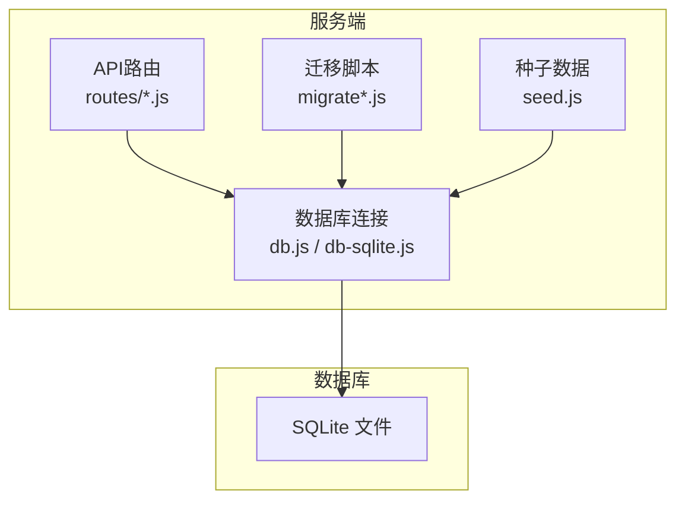
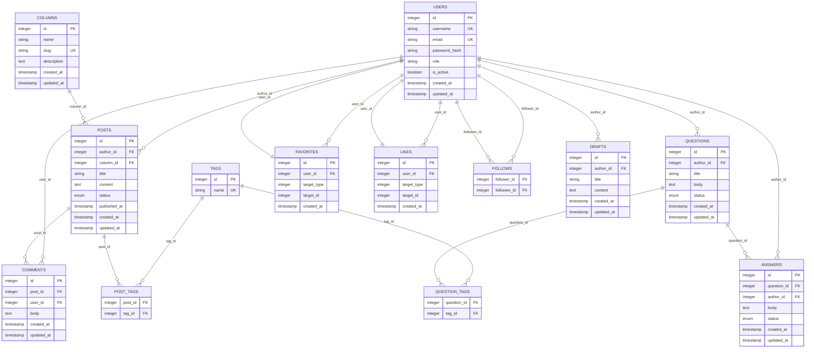
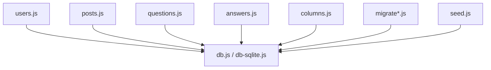
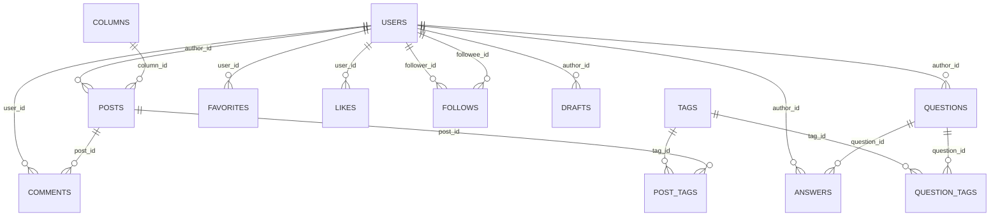

# 数据模型设计

<cite>
**本文引用的文件**   
- [server/src/db.js](file://server/src/db.js)
- [server/src/db-sqlite.js](file://server/src/db-sqlite.js)
- [server/src/migrate.js](file://server/src/migrate.js)
- [server/src/migrate-v3.js](file://server/src/migrate-v3.js)
- [server/src/migrate-draft.js](file://server/src/migrate-draft.js)
- [server/src/seed.js](file://server/src/seed.js)
- [server/src/routes/users.js](file://server/src/routes/users.js)
- [server/src/routes/posts.js](file://server/src/routes/posts.js)
- [server/src/routes/questions.js](file://server/src/routes/questions.js)
- [server/src/routes/answers.js](file://server/src/routes/answers.js)
- [server/src/routes/columns.js](file://server/src/routes/columns.js)
- [server/src/check-users.js](file://server/src/check-users.js)
- [server/src/add_column.js](file://server/src/add_column.js)
- [server/src/check_schema.js](file://server/src/check_schema.js)
</cite>

## 目录
1. [简介](#简介)
2. [项目结构](#项目结构)
3. [核心组件](#核心组件)
4. [架构总览](#架构总览)
5. [详细组件分析](#详细组件分析)
6. [依赖分析](#依赖分析)
7. [性能考虑](#性能考虑)
8. [故障排查指南](#故障排查指南)
9. [结论](#结论)
10. [附录](#附录)

## 简介
本文件面向后端与数据库相关的数据模型设计，聚焦于用户、文章、评论、问答（问题与答案）、专栏等核心实体。文档从表结构定义、字段类型与业务规则、关系映射、索引与约束、完整性保证机制等方面展开，并提供ER图与SQL建表示例路径，帮助读者快速理解并落地实现。

## 项目结构
本项目采用前后端分离的Next.js + Node.js架构。数据模型相关的代码集中在 server 目录下：
- 数据库连接与初始化：db.js、db-sqlite.js
- 迁移脚本：migrate.js、migrate-v3.js、migrate-draft.js
- 种子数据：seed.js
- 路由层：users.js、posts.js、questions.js、answers.js、columns.js
- 辅助工具：check-users.js、add_column.js、check_schema.js

图表来源
- [server/src/db.js:1-200](file://server/src/db.js#L1-L200)
- [server/src/db-sqlite.js:1-200](file://server/src/db-sqlite.js#L1-L200)
- [server/src/migrate.js:1-200](file://server/src/migrate.js#L1-L200)
- [server/src/migrate-v3.js:1-200](file://server/src/migrate-v3.js#L1-L200)
- [server/src/migrate-draft.js:1-200](file://server/src/migrate-draft.js#L1-L200)
- [server/src/seed.js:1-200](file://server/src/seed.js#L1-L200)

章节来源
- [server/src/db.js:1-200](file://server/src/db.js#L1-L200)
- [server/src/db-sqlite.js:1-200](file://server/src/db-sqlite.js#L1-L200)
- [server/src/migrate.js:1-200](file://server/src/migrate.js#L1-L200)
- [server/src/migrate-v3.js:1-200](file://server/src/migrate-v3.js#L1-L200)
- [server/src/migrate-draft.js:1-200](file://server/src/migrate-draft.js#L1-L200)
- [server/src/seed.js:1-200](file://server/src/seed.js#L1-L200)

## 核心组件
本节梳理核心实体及其职责：
- 用户（users）：账号、认证信息、角色与状态
- 文章（posts）：标题、内容、分类、作者、发布状态
- 评论（comments）：对文章或问答的评论
- 问答（questions、answers）：问题与答案的关联
- 专栏（columns）：文章集合的组织单元
- 标签（tags）：文章与问答的标签体系
- 收藏（favorites）：用户对文章或问答的收藏
- 点赞（likes）：用户对文章或问答的点赞
- 关注（follows）：用户之间的关注关系
- 草稿（drafts）：文章的草稿版本

章节来源
- [server/src/routes/users.js:1-200](file://server/src/routes/users.js#L1-L200)
- [server/src/routes/posts.js:1-200](file://server/src/routes/posts.js#L1-L200)
- [server/src/routes/questions.js:1-200](file://server/src/routes/questions.js#L1-L200)
- [server/src/routes/answers.js:1-200](file://server/src/routes/answers.js#L1-L200)
- [server/src/routes/columns.js:1-200](file://server/src/routes/columns.js#L1-L200)

## 架构总览
下图展示数据模型的整体关系，包括一对一、一对多与多对多关系的实现方式。

图表来源
- [server/src/migrate.js:1-200](file://server/src/migrate.js#L1-L200)
- [server/src/migrate-v3.js:1-200](file://server/src/migrate-v3.js#L1-L200)
- [server/src/migrate-draft.js:1-200](file://server/src/migrate-draft.js#L1-L200)
- [server/src/seed.js:1-200](file://server/src/seed.js#L1-L200)

## 详细组件分析

### 用户表（users）
- 主键：id（自增整数）
- 唯一性：username、email
- 关键字段：password_hash、role、is_active、created_at、updated_at
- 业务规则：
  - 用户名与邮箱全局唯一
  - 角色用于权限控制（如普通用户、管理员）
  - 启用/禁用通过 is_active 控制
- 索引策略：
  - 主键索引：id
  - 唯一索引：username、email
- 约束条件：
  - 非空约束：username、email、password_hash
  - 检查约束：role 取值限定为枚举值
- 关系：
  - 一对多：作为文章作者、评论者、问题作者、答案作者、收藏者、点赞者、关注者与被关注者
  - 一对一：可选的用户扩展信息（若存在 profiles 表）

章节来源
- [server/src/migrate.js:1-200](file://server/src/migrate.js#L1-L200)
- [server/src/check-users.js:1-200](file://server/src/check-users.js#L1-L200)

### 文章表（posts）
- 主键：id（自增整数）
- 外键：author_id → users.id；column_id → columns.id
- 关键字段：title、content、status、published_at、created_at、updated_at
- 业务规则：
  - 状态包含草稿、已发布、已归档等
  - published_at 仅在状态为“已发布”时有效
- 索引策略：
  - 主键索引：id
  - 二级索引：author_id、column_id、status、published_at
- 约束条件：
  - 非空约束：title、content、author_id、status
  - 检查约束：status 取值限定为枚举值
- 关系：
  - 多对一：作者（users）、所属专栏（columns）
  - 一对多：评论（comments）
  - 多对多：标签（通过 post_tags 中间表）

章节来源
- [server/src/migrate.js:1-200](file://server/src/migrate.js#L1-L200)
- [server/src/routes/posts.js:1-200](file://server/src/routes/posts.js#L1-200)

### 评论表（comments）
- 主键：id（自增整数）
- 外键：post_id → posts.id；user_id → users.id
- 关键字段：body、created_at、updated_at
- 业务规则：
  - 仅允许对已发布的文章进行评论
- 索引策略：
  - 主键索引：id
  - 二级索引：post_id、user_id、created_at
- 约束条件：
  - 非空约束：post_id、user_id、body
- 关系：
  - 多对一：文章（posts）、评论者（users）

章节来源
- [server/src/migrate.js:1-200](file://server/src/migrate.js#L1-L200)
- [server/src/routes/posts.js:1-200](file://server/src/routes/posts.js#L1-200)

### 问答表（questions、answers）
- 问题表（questions）
  - 主键：id
  - 外键：author_id → users.id
  - 关键字段：title、body、status、created_at、updated_at
  - 业务规则：状态包含待解决、已解决、已关闭等
  - 索引策略：主键索引；二级索引 author_id、status、created_at
  - 约束条件：非空约束 title、body、author_id、status；检查约束 status 枚举
- 答案表（answers）
  - 主键：id
  - 外键：question_id → questions.id；author_id → users.id
  - 关键字段：body、status、created_at、updated_at
  - 业务规则：答案可被标记为“采纳”
  - 索引策略：主键索引；二级索引 question_id、author_id、status、created_at
  - 约束条件：非空约束 question_id、author_id、body、status；检查约束 status 枚举
- 关系：
  - 一对多：问题（questions）→ 答案（answers）
  - 多对一：作者（users）

章节来源
- [server/src/migrate.js:1-200](file://server/src/migrate.js#L1-L200)
- [server/src/migrate-v3.js:1-200](file://server/src/migrate-v3.js#L1-L200)
- [server/src/routes/questions.js:1-200](file://server/src/routes/questions.js#L1-200)
- [server/src/routes/answers.js:1-200](file://server/src/routes/answers.js#L1-200)

### 专栏表（columns）
- 主键：id（自增整数）
- 唯一性：slug
- 关键字段：name、description、created_at、updated_at
- 业务规则：
  - slug 用于URL友好标识，需全局唯一
- 索引策略：
  - 主键索引：id
  - 唯一索引：slug
- 关系：
  - 一对多：文章（posts）

章节来源
- [server/src/migrate.js:1-200](file://server/src/migrate.js#L1-L200)
- [server/src/routes/columns.js:1-200](file://server/src/routes/columns.js#L1-200)

### 标签表（tags）与多对多关系
- 标签表（tags）
  - 主键：id
  - 唯一性：name
  - 索引策略：主键索引；唯一索引 name
- 文章-标签中间表（post_tags）
  - 复合主键：(post_id, tag_id)
  - 外键：post_id → posts.id；tag_id → tags.id
- 问答-标签中间表（question_tags）
  - 复合主键：(question_id, tag_id)
  - 外键：question_id → questions.id；tag_id → tags.id
- 业务规则：
  - 同一篇文章/问题与同一标签只能建立一次关联
- 索引策略：
  - 复合主键索引：(post_id, tag_id)、(question_id, tag_id)
  - 反向索引：tag_id 以支持按标签检索

章节来源
- [server/src/migrate.js:1-200](file://server/src/migrate.js#L1-L200)
- [server/src/migrate-v3.js:1-200](file://server/src/migrate-v3.js#L1-L200)

### 收藏表（favorites）与点赞表（likes）
- 收藏表（favorites）
  - 主键：id
  - 外键：user_id → users.id
  - 关键字段：target_type、target_id、created_at
  - 业务规则：
    - target_type 区分目标类型（如文章、问答）
    - 同一用户对同一目标只能收藏一次（可通过唯一约束实现）
  - 索引策略：主键索引；二级索引 user_id、target_type、target_id
- 点赞表（likes）
  - 主键：id
  - 外键：user_id → users.id
  - 关键字段：target_type、target_id、created_at
  - 业务规则：
    - 同一用户对同一目标只能点赞一次
  - 索引策略：主键索引；二级索引 user_id、target_type、target_id

章节来源
- [server/src/migrate.js:1-200](file://server/src/migrate.js#L1-L200)

### 关注表（follows）
- 复合主键：(follower_id, followee_id)
- 外键：follower_id → users.id；followee_id → users.id
- 业务规则：
  - 防止重复关注（复合主键保证）
  - 禁止关注自己（应用层或检查约束）
- 索引策略：
  - 复合主键索引：(follower_id, followee_id)
  - 反向索引：followee_id 以支持查询粉丝列表

章节来源
- [server/src/migrate.js:1-200](file://server/src/migrate.js#L1-L200)

### 草稿表（drafts）
- 主键：id
- 外键：author_id → users.id
- 关键字段：title、content、created_at、updated_at
- 业务规则：
  - 草稿独立于正式文章，便于编辑保存
- 索引策略：
  - 主键索引：id
  - 二级索引：author_id、updated_at
- 关系：
  - 多对一：作者（users）

章节来源
- [server/src/migrate-draft.js:1-200](file://server/src/migrate-draft.js#L1-L200)

## 依赖分析
- 模块耦合
  - 路由层（routes/*）依赖数据库连接（db.js/db-sqlite.js）执行CRUD操作
  - 迁移脚本（migrate*.js）负责DDL变更与数据一致性
  - 种子数据（seed.js）提供初始数据，便于开发与测试
- 外部依赖
  - SQLite 作为嵌入式数据库，适合轻量级部署
- 潜在循环依赖
  - 当前结构清晰，无直接循环依赖风险

图表来源
- [server/src/routes/users.js:1-200](file://server/src/routes/users.js#L1-200)
- [server/src/routes/posts.js:1-200](file://server/src/routes/posts.js#L1-200)
- [server/src/routes/questions.js:1-200](file://server/src/routes/questions.js#L1-200)
- [server/src/routes/answers.js:1-200](file://server/src/routes/answers.js#L1-200)
- [server/src/routes/columns.js:1-200](file://server/src/routes/columns.js#L1-200)
- [server/src/db.js:1-200](file://server/src/db.js#L1-L200)
- [server/src/db-sqlite.js:1-200](file://server/src/db-sqlite.js#L1-L200)
- [server/src/migrate.js:1-200](file://server/src/migrate.js#L1-L200)
- [server/src/migrate-v3.js:1-200](file://server/src/migrate-v3.js#L1-L200)
- [server/src/migrate-draft.js:1-200](file://server/src/migrate-draft.js#L1-L200)
- [server/src/seed.js:1-200](file://server/src/seed.js#L1-L200)

章节来源
- [server/src/db.js:1-200](file://server/src/db.js#L1-L200)
- [server/src/db-sqlite.js:1-200](file://server/src/db-sqlite.js#L1-L200)
- [server/src/migrate.js:1-200](file://server/src/migrate.js#L1-L200)
- [server/src/migrate-v3.js:1-200](file://server/src/migrate-v3.js#L1-L200)
- [server/src/migrate-draft.js:1-200](file://server/src/migrate-draft.js#L1-L200)
- [server/src/seed.js:1-200](file://server/src/seed.js#L1-L200)

## 性能考虑
- 索引优化
  - 高频查询字段（如 author_id、status、published_at、tag_id）建议建立二级索引
  - 复合索引用于排序与过滤组合（如 (author_id, status, created_at)）
- 查询优化
  - 避免SELECT *，按需选择字段
  - 分页使用 LIMIT/OFFSET 或基于游标的分页
- 写入优化
  - 批量插入时使用事务包裹，减少提交开销
  - 避免在热点行上频繁更新，必要时引入缓存层
- 存储优化
  - 大文本字段（content、body）考虑分表或对象存储
  - 历史数据归档至冷存储

[本节为通用指导，不直接分析具体文件]

## 故障排查指南
- 常见错误
  - 唯一性冲突：username/email/slug/name 重复导致插入失败
  - 外键约束失败：引用记录不存在或已被删除
  - 检查约束失败：枚举字段取值不在允许范围
- 诊断步骤
  - 使用 check_schema.js 验证表结构与索引
  - 使用 add_column.js 安全添加列并处理默认值
  - 使用 check-users.js 校验用户数据一致性
- 恢复策略
  - 回滚迁移脚本，确保DDL变更原子性
  - 清理脏数据后重试

章节来源
- [server/src/check_schema.js:1-200](file://server/src/check_schema.js#L1-L200)
- [server/src/add_column.js:1-200](file://server/src/add_column.js#L1-L200)
- [server/src/check-users.js:1-200](file://server/src/check-users.js#L1-L200)

## 结论
本数据模型围绕用户、文章、评论、问答、专栏、标签、收藏、点赞、关注与草稿等核心实体构建，采用主键、外键、唯一性与检查约束保障数据完整性，并通过合理的索引策略提升查询性能。迁移与种子脚本确保环境一致性与可复现性。建议在后续迭代中持续监控慢查询与热点数据，逐步完善索引与缓存策略。

[本节为总结，不直接分析具体文件]

## 附录

### ER图（概念版）

[此图为概念示意，未直接映射到具体源文件，故不提供图表来源]

### SQL建表示例（路径参考）
- 用户表建表语句示例路径：[server/src/migrate.js:1-200](file://server/src/migrate.js#L1-L200)
- 文章表建表语句示例路径：[server/src/migrate.js:1-200](file://server/src/migrate.js#L1-L200)
- 评论表建表语句示例路径：[server/src/migrate.js:1-200](file://server/src/migrate.js#L1-L200)
- 问答表建表语句示例路径：[server/src/migrate.js:1-200](file://server/src/migrate.js#L1-L200)、[server/src/migrate-v3.js:1-200](file://server/src/migrate-v3.js#L1-L200)
- 专栏表建表语句示例路径：[server/src/migrate.js:1-200](file://server/src/migrate.js#L1-L200)
- 标签与多对中间表建表语句示例路径：[server/src/migrate.js:1-200](file://server/src/migrate.js#L1-L200)、[server/src/migrate-v3.js:1-200](file://server/src/migrate-v3.js#L1-L200)
- 收藏与点赞表建表语句示例路径：[server/src/migrate.js:1-200](file://server/src/migrate.js#L1-L200)
- 关注表建表语句示例路径：[server/src/migrate.js:1-200](file://server/src/migrate.js#L1-L200)
- 草稿表建表语句示例路径：[server/src/migrate-draft.js:1-200](file://server/src/migrate-draft.js#L1-L200)

章节来源
- [server/src/migrate.js:1-200](file://server/src/migrate.js#L1-L200)
- [server/src/migrate-v3.js:1-200](file://server/src/migrate-v3.js#L1-L200)
- [server/src/migrate-draft.js:1-200](file://server/src/migrate-draft.js#L1-L200)