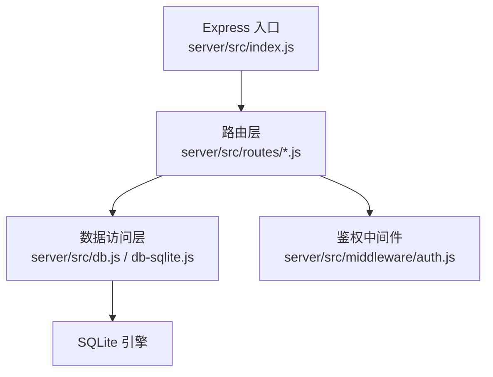
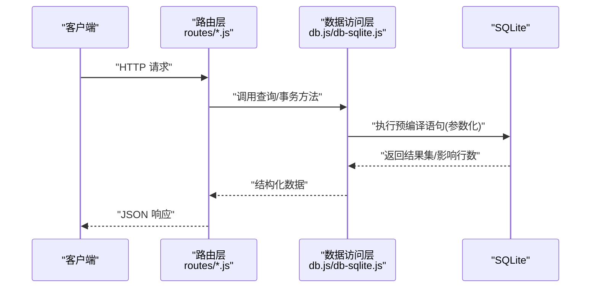
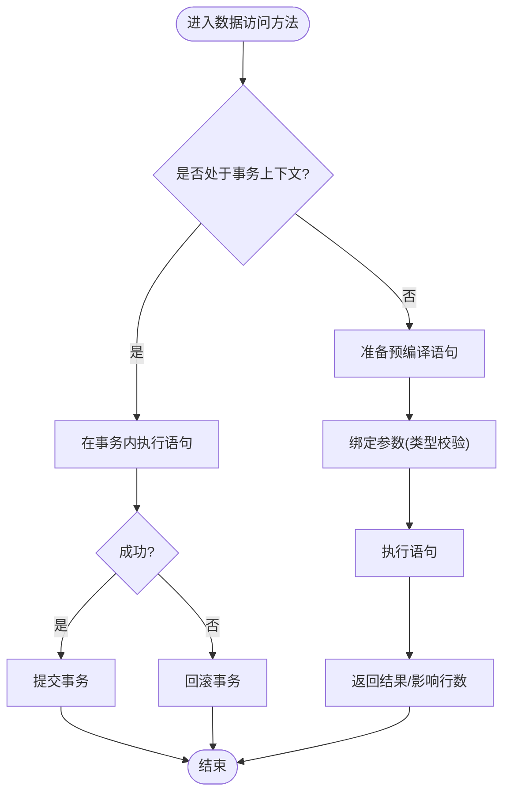
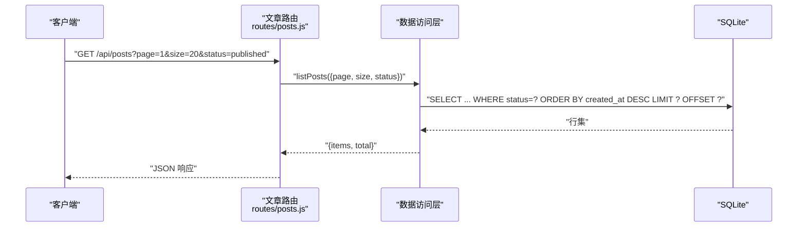
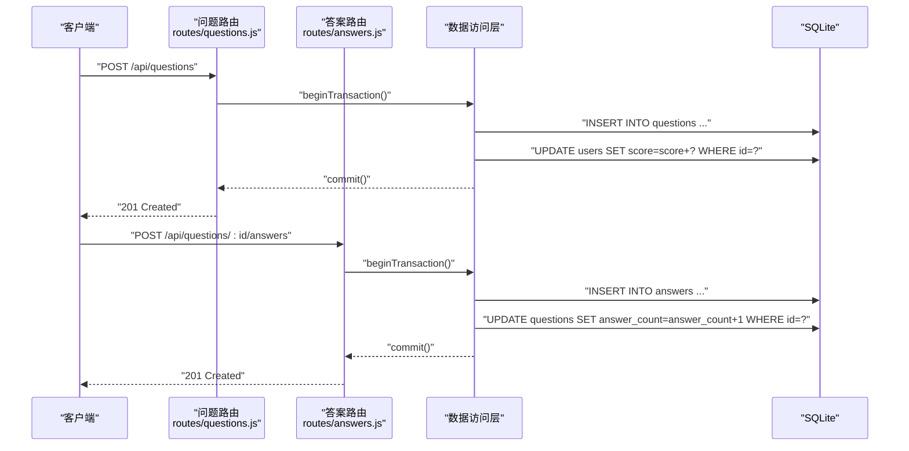
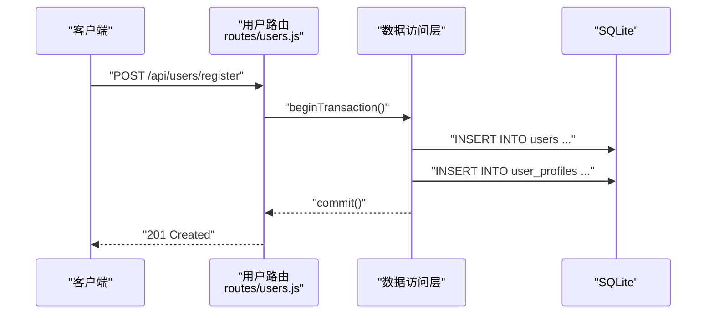
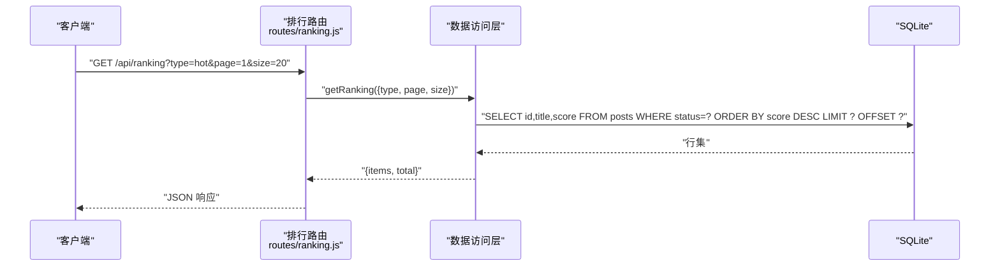
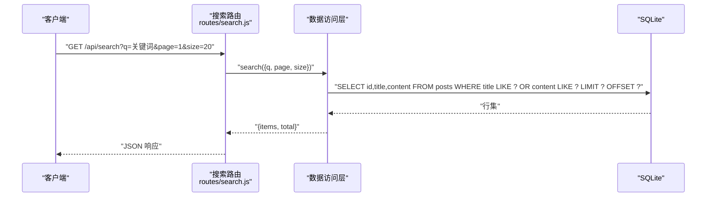
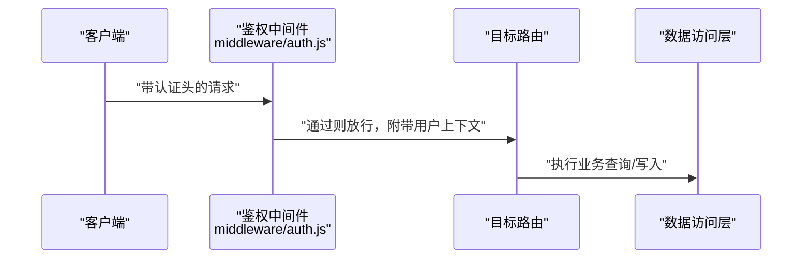

# 查询操作与优化

<cite>
**本文引用的文件**   
- [server/src/db.js](file://server/src/db.js)
- [server/src/db-sqlite.js](file://server/src/db-sqlite.js)
- [server/src/routes/posts.js](file://server/src/routes/posts.js)
- [server/src/routes/questions.js](file://server/src/routes/questions.js)
- [server/src/routes/answers.js](file://server/src/routes/answers.js)
- [server/src/routes/users.js](file://server/src/routes/users.js)
- [server/src/routes/ranking.js](file://server/src/routes/ranking.js)
- [server/src/routes/search.js](file://server/src/routes/search.js)
- [server/src/middleware/auth.js](file://server/src/middleware/auth.js)
- [server/src/index.js](file://server/src/index.js)
</cite>

## 目录
1. [简介](#简介)
2. [项目结构](#项目结构)
3. [核心组件](#核心组件)
4. [架构总览](#架构总览)
5. [详细组件分析](#详细组件分析)
6. [依赖分析](#依赖分析)
7. [性能考虑](#性能考虑)
8. [故障排查指南](#故障排查指南)
9. [结论](#结论)
10. [附录](#附录)

## 简介
本文件聚焦于后端数据库访问层与相关路由的查询构建、事务处理、参数化与安全、以及查询优化策略。内容覆盖：
- SQL 查询构建与参数化（防注入、类型安全）
- 事务机制（ACID、隔离级别、并发控制）
- 查询优化（索引、重写、执行计划）
- 批量操作与分页实现方案
- 常见查询模式与调优建议

## 项目结构
后端采用 Express 路由 + SQLite 驱动的分层结构：
- 数据访问层：封装连接、事务、通用查询方法
- 业务路由层：按资源划分（文章、问答、用户、排行、搜索等）
- 中间件：鉴权与权限校验
- 入口：应用启动与路由挂载

图表来源
- [server/src/index.js](file://server/src/index.js)
- [server/src/db.js](file://server/src/db.js)
- [server/src/db-sqlite.js](file://server/src/db-sqlite.js)
- [server/src/routes/posts.js](file://server/src/routes/posts.js)
- [server/src/middleware/auth.js](file://server/src/middleware/auth.js)

章节来源
- [server/src/index.js](file://server/src/index.js)
- [server/src/db.js](file://server/src/db.js)
- [server/src/db-sqlite.js](file://server/src/db-sqlite.js)

## 核心组件
- 数据库连接与基础查询封装：提供连接管理、预编译语句执行、事务封装、批量写入等能力，确保参数化与类型安全。
- 资源路由：对文章、问答、用户、排行、搜索等模块暴露 RESTful API，并在路由中组织查询条件、分页与排序。
- 鉴权中间件：在需要权限的路由前进行身份与角色校验，保障写操作安全。

章节来源
- [server/src/db.js](file://server/src/db.js)
- [server/src/db-sqlite.js](file://server/src/db-sqlite.js)
- [server/src/routes/posts.js](file://server/src/routes/posts.js)
- [server/src/routes/questions.js](file://server/src/routes/questions.js)
- [server/src/routes/answers.js](file://server/src/routes/answers.js)
- [server/src/routes/users.js](file://server/src/routes/users.js)
- [server/src/routes/ranking.js](file://server/src/routes/ranking.js)
- [server/src/routes/search.js](file://server/src/routes/search.js)
- [server/src/middleware/auth.js](file://server/src/middleware/auth.js)

## 架构总览
下图展示了从请求到数据库的完整调用链，并标注了事务与参数化的关键位置。

图表来源
- [server/src/routes/posts.js](file://server/src/routes/posts.js)
- [server/src/routes/questions.js](file://server/src/routes/questions.js)
- [server/src/routes/answers.js](file://server/src/routes/answers.js)
- [server/src/routes/users.js](file://server/src/routes/users.js)
- [server/src/routes/ranking.js](file://server/src/routes/ranking.js)
- [server/src/routes/search.js](file://server/src/routes/search.js)
- [server/src/db.js](file://server/src/db.js)
- [server/src/db-sqlite.js](file://server/src/db-sqlite.js)

## 详细组件分析

### 数据访问层：db.js 与 db-sqlite.js
- 职责
  - 统一数据库连接与配置
  - 提供预编译语句执行接口，强制使用占位符与参数数组，避免字符串拼接
  - 封装事务执行流程，支持提交与回滚
  - 提供批量插入/更新工具方法，减少往返开销
- 关键点
  - 参数化查询：所有外部输入通过参数数组传入，禁止直接拼接到 SQL 文本
  - 类型安全：在参数传递前进行必要类型转换与校验（如数字、布尔、时间戳）
  - 事务语义：BEGIN/COMMIT/ROLLBACK 包裹多条语句，保证 ACID
  - 错误处理：捕获异常并回滚事务，向上抛出结构化错误信息

图表来源
- [server/src/db.js](file://server/src/db.js)
- [server/src/db-sqlite.js](file://server/src/db-sqlite.js)

章节来源
- [server/src/db.js](file://server/src/db.js)
- [server/src/db-sqlite.js](file://server/src/db-sqlite.js)

### 路由层：posts.js（文章）
- 典型查询模式
  - 列表分页：基于 LIMIT/OFFSET 或游标式分页；结合 WHERE 过滤、ORDER BY 排序
  - 详情获取：主键精确查找
  - 统计计数：COUNT 聚合用于分页元信息
- 参数化与安全
  - 所有查询条件来自请求参数时，均通过参数数组传入
  - 对页码、每页大小等数值型参数进行范围与类型校验
- 事务场景
  - 发布文章可能涉及多表写入（文章、标签、分类），使用事务保证一致性

图表来源
- [server/src/routes/posts.js](file://server/src/routes/posts.js)
- [server/src/db.js](file://server/src/db.js)
- [server/src/db-sqlite.js](file://server/src/db-sqlite.js)

章节来源
- [server/src/routes/posts.js](file://server/src/routes/posts.js)

### 路由层：questions.js 与 answers.js（问答）
- 典型查询模式
  - 问题列表：按热度/时间排序，支持标签筛选
  - 答案列表：按点赞数/时间排序，支持分页
  - 关联查询：JOIN 获取作者信息与答案数量
- 事务场景
  - 回答创建可能同时写入答案表与用户积分表，需事务保证一致

图表来源
- [server/src/routes/questions.js](file://server/src/routes/questions.js)
- [server/src/routes/answers.js](file://server/src/routes/answers.js)
- [server/src/db.js](file://server/src/db.js)
- [server/src/db-sqlite.js](file://server/src/db-sqlite.js)

章节来源
- [server/src/routes/questions.js](file://server/src/routes/questions.js)
- [server/src/routes/answers.js](file://server/src/routes/answers.js)

### 路由层：users.js（用户）
- 典型查询模式
  - 登录校验：用户名/邮箱唯一性检查与密码比对
  - 资料更新：字段白名单校验与空值保护
- 事务场景
  - 注册流程可能同时写入用户表与默认资料表，需事务保证一致性

图表来源
- [server/src/routes/users.js](file://server/src/routes/users.js)
- [server/src/db.js](file://server/src/db.js)
- [server/src/db-sqlite.js](file://server/src/db-sqlite.js)

章节来源
- [server/src/routes/users.js](file://server/src/routes/users.js)

### 路由层：ranking.js（排行）
- 典型查询模式
  - 综合排行：多指标加权排序，注意排序列的索引设计
  - 分组聚合：按类别/标签统计 Top N
- 优化要点
  - 使用覆盖索引减少回表
  - 限制返回字段，避免 SELECT *

图表来源
- [server/src/routes/ranking.js](file://server/src/routes/ranking.js)
- [server/src/db.js](file://server/src/db.js)
- [server/src/db-sqlite.js](file://server/src/db-sqlite.js)

章节来源
- [server/src/routes/ranking.js](file://server/src/routes/ranking.js)

### 路由层：search.js（全文检索）
- 典型查询模式
  - 关键词匹配：LIKE 或 FTS 扩展（若启用）
  - 高亮与片段截取：在应用层完成
- 安全与性能
  - 关键词必须参数化，防止注入
  - 为常用搜索词建立合适索引或使用 FTS 表

图表来源
- [server/src/routes/search.js](file://server/src/routes/search.js)
- [server/src/db.js](file://server/src/db.js)
- [server/src/db-sqlite.js](file://server/src/db-sqlite.js)

章节来源
- [server/src/routes/search.js](file://server/src/routes/search.js)

### 鉴权中间件：auth.js
- 职责
  - 解析令牌/会话，校验用户身份与角色
  - 将用户上下文注入后续路由处理器
- 与查询的关系
  - 写操作前强制鉴权，避免越权写入
  - 读操作可按角色决定可见范围（如仅管理员可查草稿）

图表来源
- [server/src/middleware/auth.js](file://server/src/middleware/auth.js)
- [server/src/routes/posts.js](file://server/src/routes/posts.js)
- [server/src/routes/users.js](file://server/src/routes/users.js)

章节来源
- [server/src/middleware/auth.js](file://server/src/middleware/auth.js)

## 依赖分析
- 耦合关系
  - 路由层依赖数据访问层提供的统一接口，屏蔽底层差异
  - 数据访问层依赖具体数据库驱动（SQLite）
- 外部依赖
  - SQLite 作为嵌入式数据库，适合中小规模与快速迭代
- 潜在风险
  - 若存在循环引用或过深依赖，应通过分层与接口解耦

图表来源
- [server/src/index.js](file://server/src/index.js)
- [server/src/db.js](file://server/src/db.js)
- [server/src/db-sqlite.js](file://server/src/db-sqlite.js)
- [server/src/middleware/auth.js](file://server/src/middleware/auth.js)

章节来源
- [server/src/index.js](file://server/src/index.js)
- [server/src/db.js](file://server/src/db.js)
- [server/src/db-sqlite.js](file://server/src/db-sqlite.js)
- [server/src/middleware/auth.js](file://server/src/middleware/auth.js)

## 性能考虑
- 索引设计
  - 为高频 WHERE、JOIN、ORDER BY 列建立单列或复合索引
  - 针对排序列与过滤列组合，优先选择选择性高的列在前
- 查询重写
  - 避免 SELECT *，只取必要字段
  - 用 EXISTS 替代 IN 子查询，必要时改写为 JOIN
  - 将复杂计算下沉至数据库侧，减少应用层处理
- 分页优化
  - 大偏移量时使用“基于上次 ID 的游标分页”替代 OFFSET
  - 先 COUNT 再分页改为“近似总数 + 下一页判断”
- 事务与锁
  - 缩小事务范围，减少持有锁的时间
  - 合理设置隔离级别，平衡一致性与并发度
- 执行计划分析
  - 使用 EXPLAIN/EXPLAIN QUERY PLAN 定位全表扫描与缺失索引
  - 关注 Join Order、Index Usage、Temporary Table 与 Filesort

[本节为通用指导，不直接分析具体文件]

## 故障排查指南
- 常见问题
  - 参数未正确绑定导致 SQL 语法错误或注入风险
  - 事务未提交或异常未回滚导致数据不一致
  - 缺少索引导致慢查询与高 CPU
- 定位步骤
  - 开启详细日志，记录 SQL 与参数
  - 使用 EXPLAIN 分析慢查询
  - 检查事务边界与异常分支的回滚逻辑
- 修复建议
  - 统一使用参数化接口，禁止字符串拼接
  - 在事务入口与出口增加 try/catch 与 finally 确保提交/回滚
  - 根据 EXPLAIN 结果补充索引或重写查询

章节来源
- [server/src/db.js](file://server/src/db.js)
- [server/src/db-sqlite.js](file://server/src/db-sqlite.js)
- [server/src/routes/posts.js](file://server/src/routes/posts.js)
- [server/src/routes/questions.js](file://server/src/routes/questions.js)
- [server/src/routes/answers.js](file://server/src/routes/answers.js)
- [server/src/routes/users.js](file://server/src/routes/users.js)
- [server/src/routes/ranking.js](file://server/src/routes/ranking.js)
- [server/src/routes/search.js](file://server/src/routes/search.js)

## 结论
通过统一的参数化与事务封装、规范化的路由查询构建与严格的鉴权，系统在保证安全与一致性的同时具备良好的可扩展性。配合合理的索引设计与查询重写，可在 SQLite 环境下获得稳定且高效的查询性能。建议在上线前引入执行计划分析与压测，持续优化热点路径。

[本节为总结性内容，不直接分析具体文件]

## 附录

### 参数化查询与类型安全清单
- 所有外部输入一律通过参数数组传入，禁止字符串拼接
- 数值型参数进行范围与类型校验（如页码、每页大小）
- 布尔与时间戳在入库前做规范化处理
- 对敏感字段（如密码）使用哈希存储，不在日志中输出明文

章节来源
- [server/src/db.js](file://server/src/db.js)
- [server/src/db-sqlite.js](file://server/src/db-sqlite.js)

### 事务处理与并发控制要点
- 明确事务边界，尽量缩短事务时长
- 在异常分支确保回滚，避免脏数据
- 根据业务需求选择合适的隔离级别（默认通常足够）
- 对热点行加锁的场景，考虑分片或异步补偿

章节来源
- [server/src/db.js](file://server/src/db.js)
- [server/src/db-sqlite.js](file://server/src/db-sqlite.js)

### 分页与批量操作最佳实践
- 分页
  - 小数据量：LIMIT/OFFSET
  - 大数据量：基于游标的分页（last_id 或 last_timestamp）
- 批量
  - 合并多次 INSERT 为单次批量插入
  - 使用事务包裹批量操作，失败整体回滚

章节来源
- [server/src/db.js](file://server/src/db.js)
- [server/src/db-sqlite.js](file://server/src/db-sqlite.js)

### 常见查询模式参考路径
- 文章列表与详情：[server/src/routes/posts.js](file://server/src/routes/posts.js)
- 问题与答案：[server/src/routes/questions.js](file://server/src/routes/questions.js)、[server/src/routes/answers.js](file://server/src/routes/answers.js)
- 用户注册与登录：[server/src/routes/users.js](file://server/src/routes/users.js)
- 排行榜：[server/src/routes/ranking.js](file://server/src/routes/ranking.js)
- 搜索：[server/src/routes/search.js](file://server/src/routes/search.js)
- 数据访问封装：[server/src/db.js](file://server/src/db.js)、[server/src/db-sqlite.js](file://server/src/db-sqlite.js)
- 鉴权中间件：[server/src/middleware/auth.js](file://server/src/middleware/auth.js)