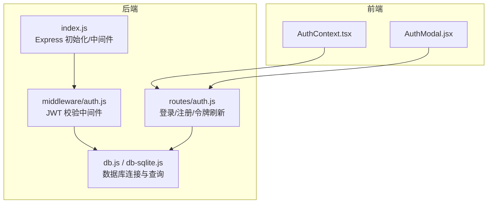
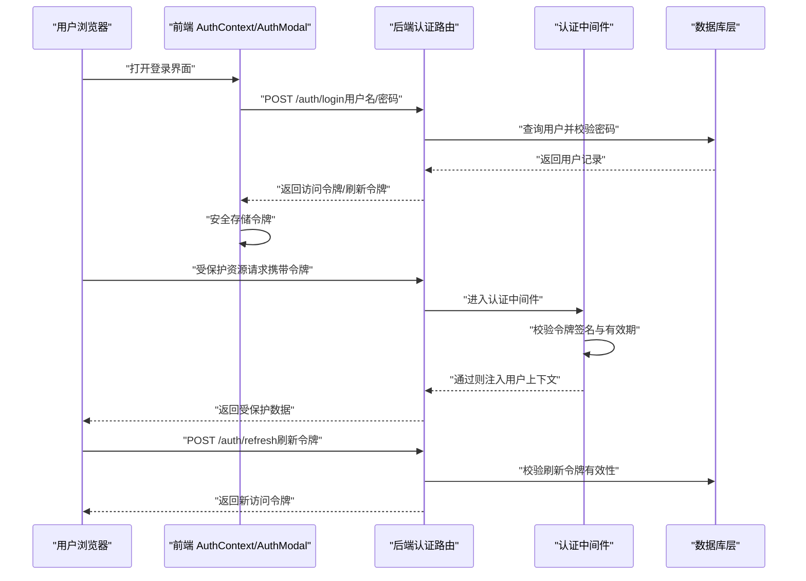
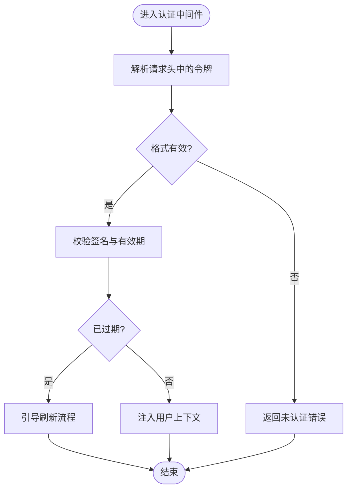
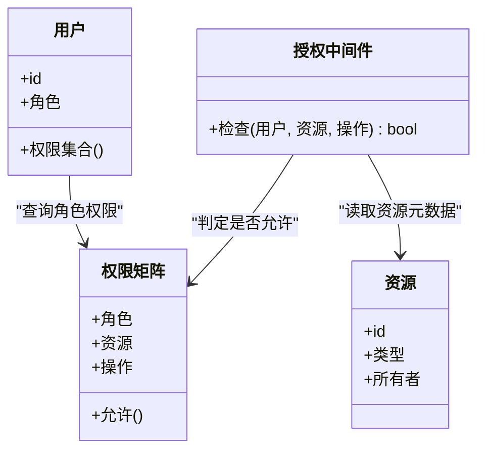
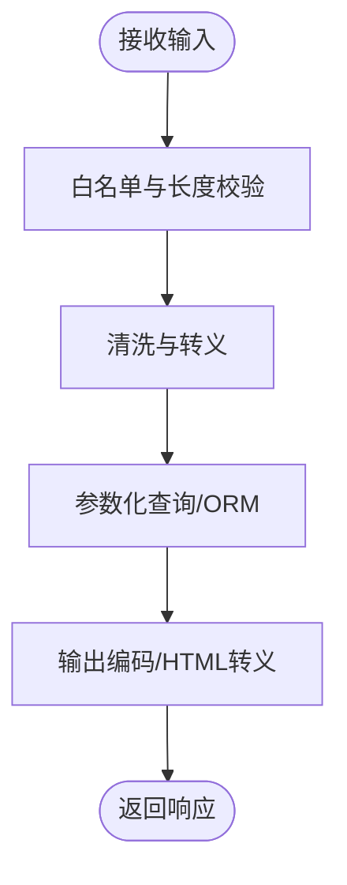
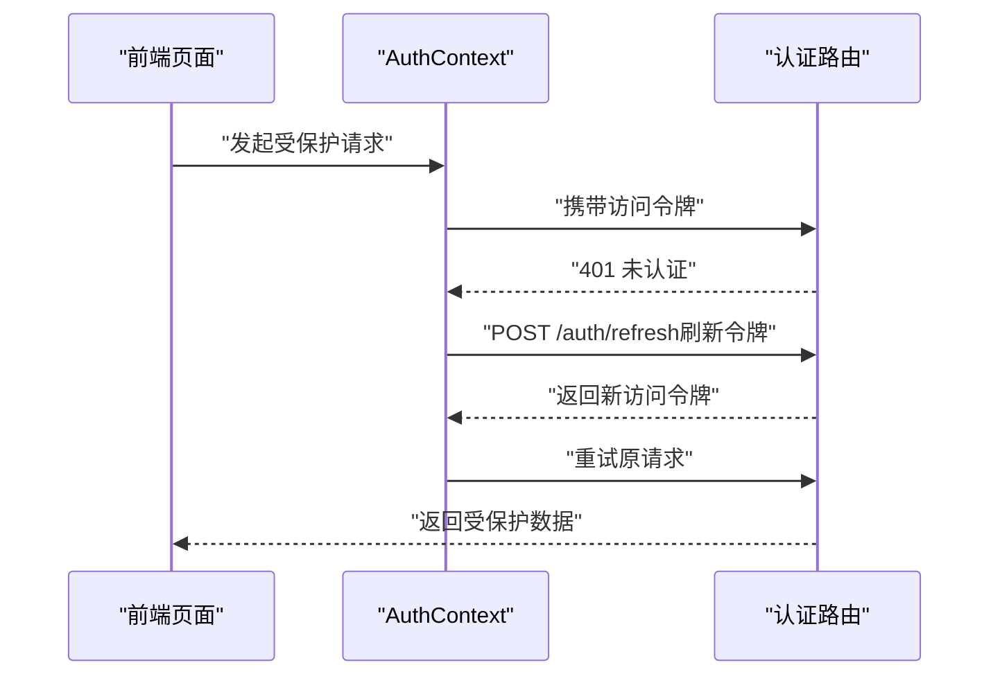
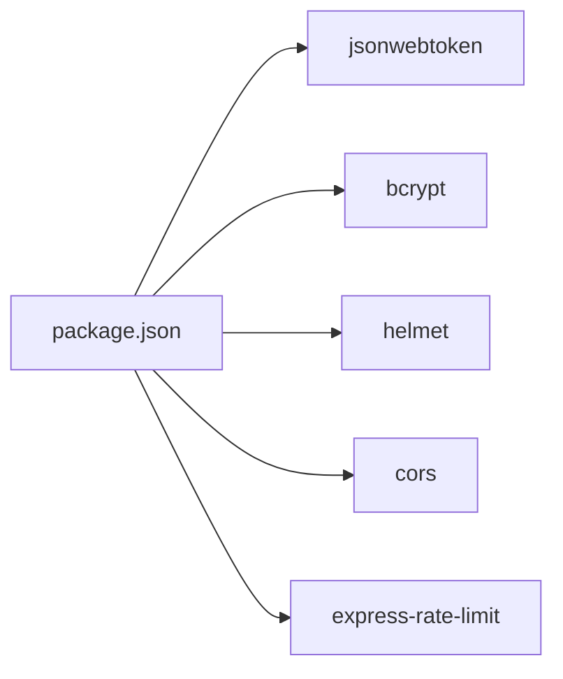

# 安全架构

<cite>
**本文引用的文件**   
- [server/src/middleware/auth.js](file://server/src/middleware/auth.js)
- [server/src/routes/auth.js](file://server/src/routes/auth.js)
- [server/src/index.js](file://server/src/index.js)
- [server/src/db.js](file://server/src/db.js)
- [server/src/db-sqlite.js](file://server/src/db-sqlite.js)
- [src/context/AuthContext.tsx](file://src/context/AuthContext.tsx)
- [src/components/AuthModal/AuthModal.jsx](file://src/components/AuthModal/AuthModal.jsx)
- [server/package.json](file://server/package.json)
</cite>

## 目录
1. [简介](#简介)
2. [项目结构](#项目结构)
3. [核心组件](#核心组件)
4. [架构总览](#架构总览)
5. [详细组件分析](#详细组件分析)
6. [依赖分析](#依赖分析)
7. [性能考虑](#性能考虑)
8. [故障排查指南](#故障排查指南)
9. [结论](#结论)
10. [附录](#附录)

## 简介
本安全架构文档聚焦于博客系统的安全机制与防护措施，覆盖以下关键主题：
- JWT 认证机制：令牌的生成、验证、刷新与过期处理
- 权限控制模型：角色权限、资源访问控制与操作授权
- 输入验证与输出编码：防止 XSS 与 SQL 注入
- 密码加密存储与用户隐私保护
- HTTPS 配置与安全响应头设置
- 安全最佳实践与常见漏洞防护方案

## 项目结构
后端采用 Node.js + Express 架构，安全相关代码主要位于 server 目录；前端 Next.js 应用通过上下文与组件管理登录态。

图示来源
- [server/src/index.js](file://server/src/index.js)
- [server/src/middleware/auth.js](file://server/src/middleware/auth.js)
- [server/src/routes/auth.js](file://server/src/routes/auth.js)
- [server/src/db.js](file://server/src/db.js)
- [server/src/db-sqlite.js](file://server/src/db-sqlite.js)
- [src/context/AuthContext.tsx](file://src/context/AuthContext.tsx)
- [src/components/AuthModal/AuthModal.jsx](file://src/components/AuthModal/AuthModal.jsx)

章节来源
- [server/src/index.js](file://server/src/index.js)
- [server/src/middleware/auth.js](file://server/src/middleware/auth.js)
- [server/src/routes/auth.js](file://server/src/routes/auth.js)
- [server/src/db.js](file://server/src/db.js)
- [server/src/db-sqlite.js](file://server/src/db-sqlite.js)
- [src/context/AuthContext.tsx](file://src/context/AuthContext.tsx)
- [src/components/AuthModal/AuthModal.jsx](file://src/components/AuthModal/AuthModal.jsx)

## 核心组件
- 认证中间件：负责解析请求中的令牌并校验签名、有效期，将用户信息注入请求上下文，供后续路由进行鉴权。
- 认证路由：提供登录、注册、令牌刷新等接口，完成凭据校验、令牌签发与续期。
- 数据库层：负责用户数据读写，需确保使用参数化查询与合适的哈希算法存储敏感信息。
- 前端认证上下文：集中管理登录态、令牌存取与状态同步。
- 认证弹窗组件：封装登录/注册交互流程，调用后端认证接口。

章节来源
- [server/src/middleware/auth.js](file://server/src/middleware/auth.js)
- [server/src/routes/auth.js](file://server/src/routes/auth.js)
- [server/src/db.js](file://server/src/db.js)
- [server/src/db-sqlite.js](file://server/src/db-sqlite.js)
- [src/context/AuthContext.tsx](file://src/context/AuthContext.tsx)
- [src/components/AuthModal/AuthModal.jsx](file://src/components/AuthModal/AuthModal.jsx)

## 架构总览
下图展示从前端到后端的认证与鉴权主流程，包括令牌签发、校验与刷新。

图示来源
- [server/src/routes/auth.js](file://server/src/routes/auth.js)
- [server/src/middleware/auth.js](file://server/src/middleware/auth.js)
- [server/src/db.js](file://server/src/db.js)
- [server/src/db-sqlite.js](file://server/src/db-sqlite.js)
- [src/context/AuthContext.tsx](file://src/context/AuthContext.tsx)
- [src/components/AuthModal/AuthModal.jsx](file://src/components/AuthModal/AuthModal.jsx)

## 详细组件分析

### JWT 认证机制
- 令牌生成
  - 登录成功后，服务端根据用户标识与必要声明生成访问令牌，并可选签发刷新令牌用于续期。
  - 建议为令牌设置较短的有效期，并通过刷新令牌实现无感续期。
- 令牌验证
  - 认证中间件在每次请求时解析令牌，校验签名与有效期，失败则拒绝访问。
  - 建议对令牌来源进行严格校验，仅接受来自可信前端的请求。
- 令牌刷新
  - 提供独立的刷新接口，校验刷新令牌后签发新的访问令牌。
  - 刷新令牌应独立存储且具备更严格的访问限制。
- 过期处理
  - 前端在收到 401 或特定错误码时触发刷新流程；若刷新失败则引导重新登录。
  - 服务端应在令牌过期时返回明确的状态码与提示，便于前端统一处理。

图示来源
- [server/src/middleware/auth.js](file://server/src/middleware/auth.js)
- [server/src/routes/auth.js](file://server/src/routes/auth.js)

章节来源
- [server/src/middleware/auth.js](file://server/src/middleware/auth.js)
- [server/src/routes/auth.js](file://server/src/routes/auth.js)

### 权限控制模型
- 角色与资源
  - 基于角色的访问控制（RBAC）：定义角色（如普通用户、管理员），并为角色分配资源与操作权限。
  - 资源粒度：按模块与动作划分，例如文章创建、编辑、删除，问答发布、审核等。
- 授权策略
  - 在认证中间件之后增加授权检查，依据当前用户的角色与目标资源的权限矩阵进行判断。
  - 对于敏感操作（如删除、修改他人内容）需进行二次校验，确保主体与客体一致。
- 实施要点
  - 在服务端强制校验权限，不信任前端传递的角色信息。
  - 对越权访问进行审计与告警，记录异常行为。

图示来源
- [server/src/middleware/auth.js](file://server/src/middleware/auth.js)
- [server/src/routes/auth.js](file://server/src/routes/auth.js)

章节来源
- [server/src/middleware/auth.js](file://server/src/middleware/auth.js)
- [server/src/routes/auth.js](file://server/src/routes/auth.js)

### 输入验证与输出编码
- 输入验证
  - 对所有用户输入进行白名单校验与长度限制，避免非法字符与超长输入。
  - 使用参数化查询或 ORM 防注入，禁止拼接 SQL 字符串。
- 输出编码
  - 对渲染到页面的内容进行 HTML 转义，防止 XSS。
  - 对 JSON 响应保持默认序列化，避免直接插入脚本片段。
- 富文本与 Markdown
  - 若支持富文本或 Markdown，使用安全的解析器与白名单过滤，禁用危险标签与事件属性。
- 文件上传
  - 校验文件类型、大小与扩展名，重命名存储路径，避免可执行文件上传与路径穿越。

章节来源
- [server/src/db.js](file://server/src/db.js)
- [server/src/db-sqlite.js](file://server/src/db-sqlite.js)

### 密码加密存储与用户隐私保护
- 密码存储
  - 使用强哈希算法（如 bcrypt/scrypt/argon2）加盐存储，禁止明文或弱哈希。
  - 登录时比对哈希值，不暴露原始密码。
- 隐私保护
  - 最小化返回字段，避免泄露敏感信息（如密码哈希、内部 ID）。
  - 对用户数据进行脱敏展示，日志中屏蔽敏感字段。
- 密钥管理
  - JWT 密钥与数据库凭证通过环境变量管理，禁止硬编码。
  - 定期轮换密钥，并在部署环境中启用只读权限。

章节来源
- [server/src/db.js](file://server/src/db.js)
- [server/src/db-sqlite.js](file://server/src/db-sqlite.js)

### HTTPS 配置与安全响应头
- HTTPS
  - 在生产环境强制启用 HTTPS，配置有效的 TLS 证书与强加密套件。
  - 启用 HSTS，强制浏览器仅通过 HTTPS 访问。
- 安全响应头
  - 设置 Content-Security-Policy、X-Content-Type-Options、X-Frame-Options、Referrer-Policy 等头部，降低点击劫持与 MIME 嗅探风险。
  - 对静态资源启用缓存控制与完整性校验。
- 跨域策略
  - 精确配置 CORS，仅允许可信域名与方法，避免通配符。

章节来源
- [server/src/index.js](file://server/src/index.js)

### 前端令牌管理与刷新流程
- 令牌存储
  - 优先使用 httpOnly Cookie 存储访问令牌，避免 XSS 窃取；若必须使用内存/LocalStorage，需配合严格的 CSP 与同源策略。
- 刷新流程
  - 前端在 401 时自动调用刷新接口，成功则重试原请求；失败则跳转登录页。
- 状态同步
  - 通过全局上下文维护登录态，确保组件间一致性。

图示来源
- [src/context/AuthContext.tsx](file://src/context/AuthContext.tsx)
- [src/components/AuthModal/AuthModal.jsx](file://src/components/AuthModal/AuthModal.jsx)
- [server/src/routes/auth.js](file://server/src/routes/auth.js)

章节来源
- [src/context/AuthContext.tsx](file://src/context/AuthContext.tsx)
- [src/components/AuthModal/AuthModal.jsx](file://src/components/AuthModal/AuthModal.jsx)
- [server/src/routes/auth.js](file://server/src/routes/auth.js)

## 依赖分析
- 外部依赖
  - 认证与令牌：jsonwebtoken（用于签发与校验 JWT）
  - 密码哈希：bcrypt（用于密码加密存储）
  - 其他安全相关库：helmet（安全响应头）、cors（跨域控制）、express-rate-limit（限流）
- 版本与来源
  - 依赖版本以 package.json 为准，生产环境建议使用固定版本与锁文件，避免供应链风险。

图示来源
- [server/package.json](file://server/package.json)

章节来源
- [server/package.json](file://server/package.json)

## 性能考虑
- 令牌校验开销
  - 将高频校验逻辑优化为中间件，避免重复计算；必要时引入本地缓存减少数据库访问。
- 刷新令牌频率
  - 合理设置访问令牌有效期与刷新窗口，平衡安全性与用户体验。
- 数据库查询
  - 使用索引与分页，避免全表扫描；对敏感查询添加审计日志。
- 限流与熔断
  - 对认证与刷新接口实施速率限制，防止暴力破解与资源耗尽。

[本节为通用指导，无需具体文件引用]

## 故障排查指南
- 常见问题
  - 401 未认证：检查令牌是否存在、签名是否正确、有效期是否过期。
  - 403 禁止访问：确认用户角色与资源权限矩阵是否匹配。
  - 刷新失败：检查刷新令牌是否有效、是否被撤销或过期。
- 定位步骤
  - 查看服务端日志，关注认证中间件的错误堆栈与请求上下文。
  - 核对环境变量中的密钥配置与数据库连接参数。
  - 复现请求并捕获网络报文，确认请求头与响应头是否符合预期。
- 修复建议
  - 修正密钥配置与时间同步问题。
  - 调整权限矩阵与路由守卫逻辑。
  - 增强错误消息的可观测性，避免泄露敏感细节。

章节来源
- [server/src/middleware/auth.js](file://server/src/middleware/auth.js)
- [server/src/routes/auth.js](file://server/src/routes/auth.js)

## 结论
本安全架构围绕 JWT 认证、RBAC 权限控制、输入验证与输出编码、密码加密存储、HTTPS 与安全响应头等关键维度构建。通过前后端协同与中间件化设计，系统在保障可用性的同时提升了安全性与可维护性。建议在生产环境持续完善密钥管理、审计日志与监控告警，形成闭环的安全运营体系。

[本节为总结性内容，无需具体文件引用]

## 附录
- 安全清单
  - 强制 HTTPS 与 HSTS
  - 启用安全响应头（CSP、X-Frame-Options、X-Content-Type-Options 等）
  - 使用强哈希算法存储密码
  - 参数化查询与输入白名单校验
  - 最小权限原则与细粒度授权
  - 速率限制与异常审计
  - 密钥与环境变量管理
- 参考实现位置
  - 认证中间件：[server/src/middleware/auth.js](file://server/src/middleware/auth.js)
  - 认证路由：[server/src/routes/auth.js](file://server/src/routes/auth.js)
  - 数据库层：[server/src/db.js](file://server/src/db.js)、[server/src/db-sqlite.js](file://server/src/db-sqlite.js)
  - 前端上下文与组件：[src/context/AuthContext.tsx](file://src/context/AuthContext.tsx)、[src/components/AuthModal/AuthModal.jsx](file://src/components/AuthModal/AuthModal.jsx)
  - 服务入口与安全头：[server/src/index.js](file://server/src/index.js)
  - 依赖声明：[server/package.json](file://server/package.json)