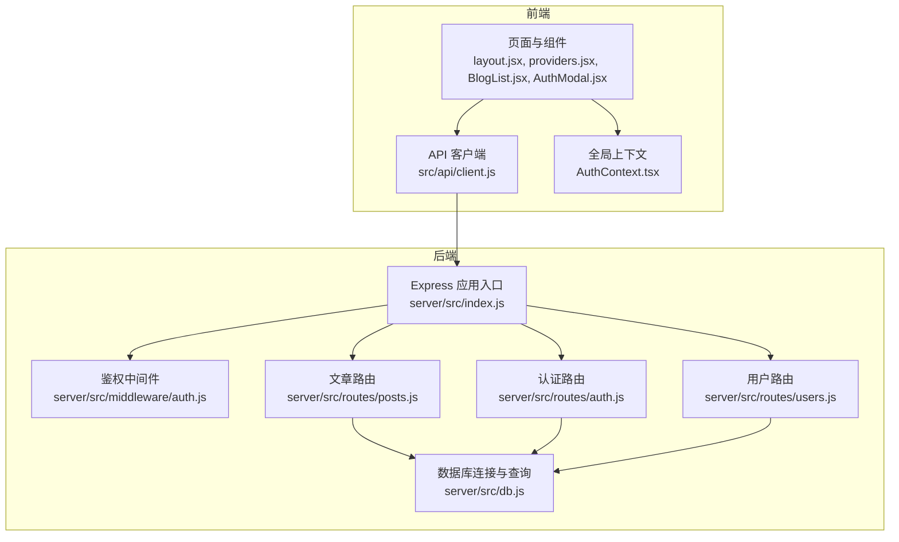
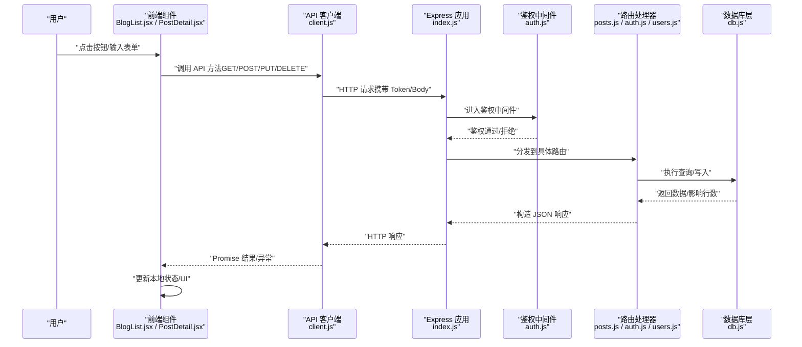
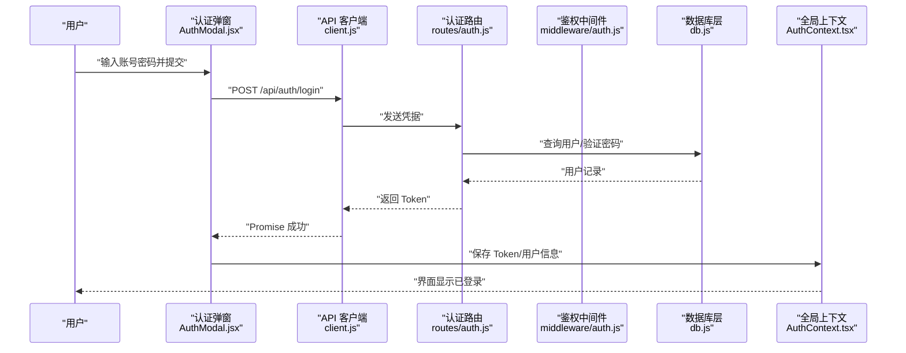
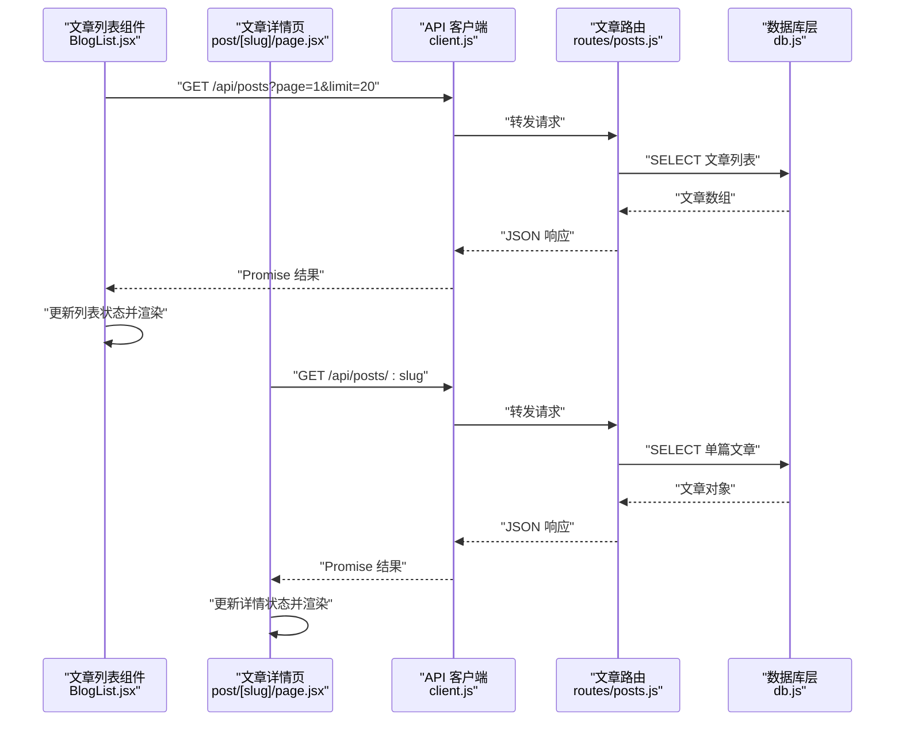
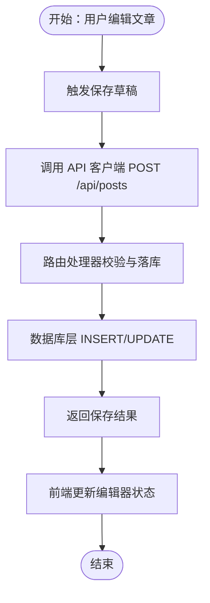
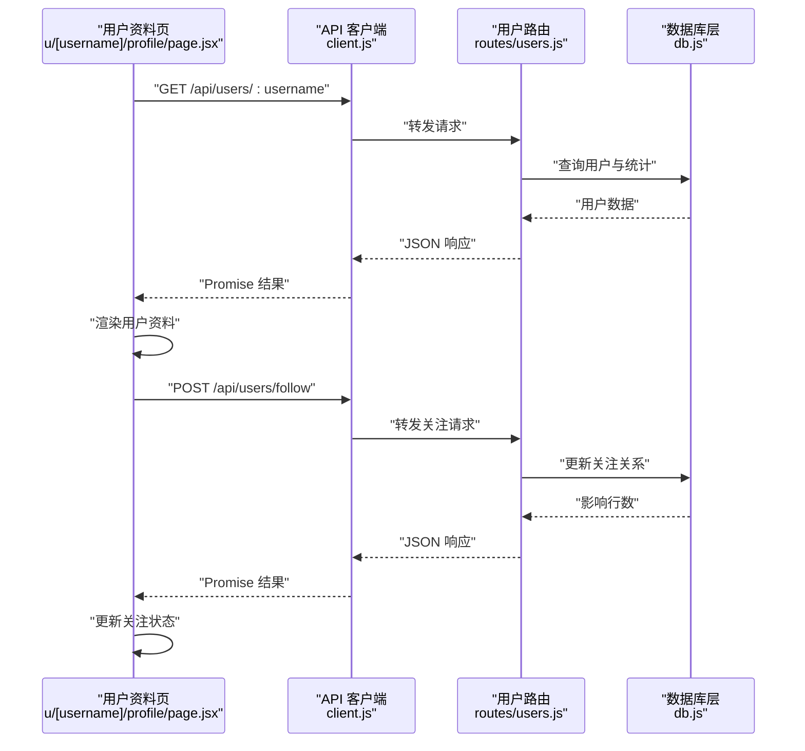
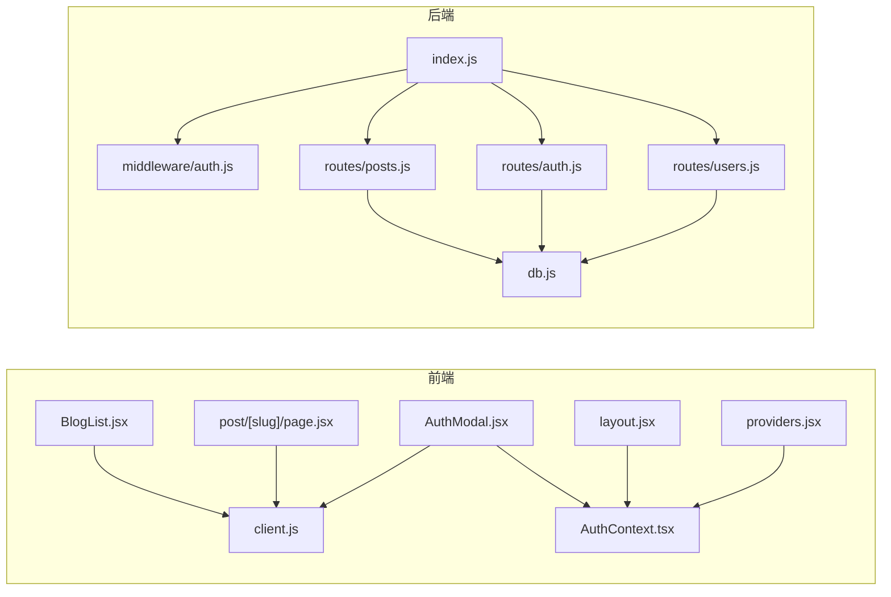

# 数据流设计

<cite>
**本文引用的文件**   
- [server/src/index.js](file://server/src/index.js)
- [server/src/db.js](file://server/src/db.js)
- [server/src/middleware/auth.js](file://server/src/middleware/auth.js)
- [server/src/routes/posts.js](file://server/src/routes/posts.js)
- [server/src/routes/auth.js](file://server/src/routes/auth.js)
- [server/src/routes/users.js](file://server/src/routes/users.js)
- [src/api/client.js](file://src/api/client.js)
- [src/app/layout.jsx](file://src/app/layout.jsx)
- [src/app/providers.jsx](file://src/app/providers.jsx)
- [src/context/AuthContext.tsx](file://src/context/AuthContext.tsx)
- [src/components/Navbar/navbar.jsx](file://src/components/Navbar/navbar.jsx)
- [src/components/BlogList/BlogList.jsx](file://src/components/BlogList/BlogList.jsx)
- [src/components/AuthModal/AuthModal.jsx](file://src/components/AuthModal/AuthModal.jsx)
- [src/app/post/[slug]/page.jsx](file://src/app/post/[slug]/page.jsx)
- [src/app/u/[username]/write/page.jsx](file://src/app/u/[username]/write/page.jsx)
</cite>

## 目录
1. [简介](#简介)
2. [项目结构](#项目结构)
3. [核心组件](#核心组件)
4. [架构总览](#架构总览)
5. [详细组件分析](#详细组件分析)
6. [依赖关系分析](#依赖关系分析)
7. [性能考虑](#性能考虑)
8. [故障排查指南](#故障排查指南)
9. [结论](#结论)
10. [附录](#附录)

## 简介
本数据流设计文档聚焦于从用户操作到前端状态更新的完整数据流转路径，覆盖以下关键环节：
- 前端组件中的交互与状态管理
- API 客户端封装与请求发送
- Express 路由处理、鉴权中间件与业务逻辑
- 数据库访问层（SQLite）的数据读写
- 响应数据的返回与前端状态更新
- 异步数据处理模式（Promise 与 async/await）
- 缓存策略与数据同步机制
- 错误处理与重试机制
- 数据流图展示各组件间的数据传递路径

## 项目结构
本项目采用前后端分离的架构：
- 前端基于 Next.js（App Router），通过 React 组件与上下文进行状态管理，统一通过 API 客户端发起 HTTP 请求。
- 后端基于 Express，提供 RESTful API，使用 SQLite 作为持久化存储，并通过中间件实现鉴权等横切关注点。

**图示来源** 
- [server/src/index.js](file://server/src/index.js)
- [server/src/middleware/auth.js](file://server/src/middleware/auth.js)
- [server/src/routes/posts.js](file://server/src/routes/posts.js)
- [server/src/routes/auth.js](file://server/src/routes/auth.js)
- [server/src/routes/users.js](file://server/src/routes/users.js)
- [server/src/db.js](file://server/src/db.js)
- [src/api/client.js](file://src/api/client.js)
- [src/app/layout.jsx](file://src/app/layout.jsx)
- [src/app/providers.jsx](file://src/app/providers.jsx)
- [src/context/AuthContext.tsx](file://src/context/AuthContext.tsx)

**章节来源**
- [server/src/index.js](file://server/src/index.js)
- [src/api/client.js](file://src/api/client.js)
- [src/app/layout.jsx](file://src/app/layout.jsx)
- [src/app/providers.jsx](file://src/app/providers.jsx)

## 核心组件
- 前端 API 客户端：统一封装 HTTP 请求，负责基础 URL、请求头、错误处理与可选的重试逻辑。
- 全局上下文（AuthContext）：集中管理登录态、用户信息、登录/登出流程，供组件订阅与消费。
- 页面与组件：如列表页、详情页、写文章页、认证弹窗等，触发用户交互并调用 API 客户端。
- 后端 Express 应用：注册路由、挂载中间件、解析请求体、转发至具体路由处理器。
- 鉴权中间件：校验 Token 或会话，决定请求是否允许继续处理。
- 路由处理器：实现具体业务逻辑，调用数据库层完成数据读写。
- 数据库层：封装 SQLite 连接与常用查询方法，为路由层提供稳定的数据访问接口。

**章节来源**
- [src/api/client.js](file://src/api/client.js)
- [src/context/AuthContext.tsx](file://src/context/AuthContext.tsx)
- [src/components/BlogList/BlogList.jsx](file://src/components/BlogList/BlogList.jsx)
- [src/components/AuthModal/AuthModal.jsx](file://src/components/AuthModal/AuthModal.jsx)
- [src/app/post/[slug]/page.jsx](file://src/app/post/[slug]/page.jsx)
- [src/app/u/[username]/write/page.jsx](file://src/app/u/[username]/write/page.jsx)
- [server/src/index.js](file://server/src/index.js)
- [server/src/middleware/auth.js](file://server/src/middleware/auth.js)
- [server/src/routes/posts.js](file://server/src/routes/posts.js)
- [server/src/routes/auth.js](file://server/src/routes/auth.js)
- [server/src/routes/users.js](file://server/src/routes/users.js)
- [server/src/db.js](file://server/src/db.js)

## 架构总览
下图展示了典型的数据流：用户在前端组件中触发操作，组件调用 API 客户端；客户端将请求发送至 Express 应用；应用经鉴权中间件后进入对应路由；路由处理器调用数据库层执行 SQL；最终响应沿原路返回，前端更新状态与视图。

**图示来源** 
- [src/components/BlogList/BlogList.jsx](file://src/components/BlogList/BlogList.jsx)
- [src/app/post/[slug]/page.jsx](file://src/app/post/[slug]/page.jsx)
- [src/api/client.js](file://src/api/client.js)
- [server/src/index.js](file://server/src/index.js)
- [server/src/middleware/auth.js](file://server/src/middleware/auth.js)
- [server/src/routes/posts.js](file://server/src/routes/posts.js)
- [server/src/routes/auth.js](file://server/src/routes/auth.js)
- [server/src/routes/users.js](file://server/src/routes/users.js)
- [server/src/db.js](file://server/src/db.js)

## 详细组件分析

### 认证数据流（登录/鉴权）
- 前端组件（如认证弹窗）收集用户名与密码，调用 API 客户端发起登录请求。
- API 客户端将凭据发送至后端认证路由。
- 鉴权中间件对后续受保护资源进行校验（Token/会话）。
- 认证路由验证凭据，成功后生成 Token 并返回给前端。
- 前端将 Token 存入上下文或本地存储，更新全局登录态，随后在后续请求中自动携带 Token。

**图示来源** 
- [src/components/AuthModal/AuthModal.jsx](file://src/components/AuthModal/AuthModal.jsx)
- [src/api/client.js](file://src/api/client.js)
- [server/src/routes/auth.js](file://server/src/routes/auth.js)
- [server/src/middleware/auth.js](file://server/src/middleware/auth.js)
- [server/src/db.js](file://server/src/db.js)
- [src/context/AuthContext.tsx](file://src/context/AuthContext.tsx)

**章节来源**
- [src/components/AuthModal/AuthModal.jsx](file://src/components/AuthModal/AuthModal.jsx)
- [src/api/client.js](file://src/api/client.js)
- [server/src/routes/auth.js](file://server/src/routes/auth.js)
- [server/src/middleware/auth.js](file://server/src/middleware/auth.js)
- [server/src/db.js](file://server/src/db.js)
- [src/context/AuthContext.tsx](file://src/context/AuthContext.tsx)

### 文章列表与详情数据流
- 列表页组件在加载时调用 API 客户端获取文章列表，支持分页参数。
- 详情页根据 slug 调用 API 客户端获取单篇文章详情。
- 后端路由接收请求，调用数据库层查询文章表，返回结构化数据。
- 前端收到响应后更新本地状态，渲染列表或详情视图。

**图示来源** 
- [src/components/BlogList/BlogList.jsx](file://src/components/BlogList/BlogList.jsx)
- [src/app/post/[slug]/page.jsx](file://src/app/post/[slug]/page.jsx)
- [src/api/client.js](file://src/api/client.js)
- [server/src/routes/posts.js](file://server/src/routes/posts.js)
- [server/src/db.js](file://server/src/db.js)

**章节来源**
- [src/components/BlogList/BlogList.jsx](file://src/components/BlogList/BlogList.jsx)
- [src/app/post/[slug]/page.jsx](file://src/app/post/[slug]/page.jsx)
- [src/api/client.js](file://src/api/client.js)
- [server/src/routes/posts.js](file://server/src/routes/posts.js)
- [server/src/db.js](file://server/src/db.js)

### 写文章与草稿保存数据流
- 用户在写文章页编辑内容，可触发“保存草稿”或“发布”操作。
- 前端调用 API 客户端提交文章数据（包含标题、正文、分类等）。
- 后端路由校验数据，必要时进行幂等处理（如按 ID 更新草稿），然后写入数据库。
- 前端收到响应后更新编辑器状态，提示保存成功或失败。

**图示来源** 
- [src/app/u/[username]/write/page.jsx](file://src/app/u/[username]/write/page.jsx)
- [src/api/client.js](file://src/api/client.js)
- [server/src/routes/posts.js](file://server/src/routes/posts.js)
- [server/src/db.js](file://server/src/db.js)

**章节来源**
- [src/app/u/[username]/write/page.jsx](file://src/app/u/[username]/write/page.jsx)
- [src/api/client.js](file://src/api/client.js)
- [server/src/routes/posts.js](file://server/src/routes/posts.js)
- [server/src/db.js](file://server/src/db.js)

### 用户资料与关注数据流
- 用户资料页加载时调用 API 客户端获取用户信息与统计。
- 关注/取消关注操作由前端组件触发，调用 API 客户端更新关注关系。
- 后端路由处理关注逻辑，调用数据库层维护关注表。
- 前端更新关注状态与计数。

**图示来源** 
- [src/app/u/[username]/profile/page.jsx](file://src/app/u/[username]/profile/page.jsx)
- [src/api/client.js](file://src/api/client.js)
- [server/src/routes/users.js](file://server/src/routes/users.js)
- [server/src/db.js](file://server/src/db.js)

**章节来源**
- [src/app/u/[username]/profile/page.jsx](file://src/app/u/[username]/profile/page.jsx)
- [src/api/client.js](file://src/api/client.js)
- [server/src/routes/users.js](file://server/src/routes/users.js)
- [server/src/db.js](file://server/src/db.js)

## 依赖关系分析
- 前端依赖：
  - 组件依赖 API 客户端进行网络请求。
  - 组件依赖全局上下文（AuthContext）管理登录态与用户信息。
  - 页面布局与提供者（layout.jsx、providers.jsx）初始化全局上下文与主题等。
- 后端依赖：
  - Express 应用入口注册所有路由与中间件。
  - 鉴权中间件被路由层依赖以保护受保护资源。
  - 路由处理器依赖数据库层进行数据访问。

**图示来源** 
- [src/components/BlogList/BlogList.jsx](file://src/components/BlogList/BlogList.jsx)
- [src/app/post/[slug]/page.jsx](file://src/app/post/[slug]/page.jsx)
- [src/components/AuthModal/AuthModal.jsx](file://src/components/AuthModal/AuthModal.jsx)
- [src/context/AuthContext.tsx](file://src/context/AuthContext.tsx)
- [src/app/layout.jsx](file://src/app/layout.jsx)
- [src/app/providers.jsx](file://src/app/providers.jsx)
- [server/src/index.js](file://server/src/index.js)
- [server/src/middleware/auth.js](file://server/src/middleware/auth.js)
- [server/src/routes/posts.js](file://server/src/routes/posts.js)
- [server/src/routes/auth.js](file://server/src/routes/auth.js)
- [server/src/routes/users.js](file://server/src/routes/users.js)
- [server/src/db.js](file://server/src/db.js)

**章节来源**
- [src/components/BlogList/BlogList.jsx](file://src/components/BlogList/BlogList.jsx)
- [src/app/post/[slug]/page.jsx](file://src/app/post/[slug]/page.jsx)
- [src/components/AuthModal/AuthModal.jsx](file://src/components/AuthModal/AuthModal.jsx)
- [src/context/AuthContext.tsx](file://src/context/AuthContext.tsx)
- [src/app/layout.jsx](file://src/app/layout.jsx)
- [src/app/providers.jsx](file://src/app/providers.jsx)
- [server/src/index.js](file://server/src/index.js)
- [server/src/middleware/auth.js](file://server/src/middleware/auth.js)
- [server/src/routes/posts.js](file://server/src/routes/posts.js)
- [server/src/routes/auth.js](file://server/src/routes/auth.js)
- [server/src/routes/users.js](file://server/src/routes/users.js)
- [server/src/db.js](file://server/src/db.js)

## 性能考虑
- 前端缓存策略：
  - 对热点数据（如首页文章列表）可采用内存级缓存或浏览器缓存（如 localStorage/sessionStorage）以减少重复请求。
  - 结合时间戳或版本号控制缓存失效，确保数据一致性。
- 后端缓存策略：
  - 对读多写少的接口（如文章列表、排行榜）引入短期缓存（如内存缓存或 Redis）以降低数据库压力。
  - 使用 ETag/Last-Modified 配合前端缓存，减少带宽消耗。
- 异步处理优化：
  - 合理使用 Promise 与 async/await，避免不必要的并发阻塞。
  - 对批量请求使用 Promise.all 并行处理，提升整体吞吐。
- 数据库优化：
  - 合理索引字段（如 slug、category、user_id），提高查询效率。
  - 分页与限流，避免一次性返回大量数据。

[本节为通用指导，不直接分析具体文件]

## 故障排查指南
- 常见错误类型：
  - 网络错误：超时、DNS 解析失败、跨域问题。
  - 鉴权失败：Token 缺失、过期或无效。
  - 业务错误：参数校验失败、资源不存在、权限不足。
  - 数据库错误：连接失败、SQL 语法错误、约束冲突。
- 错误处理建议：
  - 前端统一捕获 Promise 异常，向用户展示友好提示。
  - 对关键操作（如登录、发布）实现重试机制（指数退避），避免瞬时失败导致用户体验下降。
  - 后端记录错误日志，便于定位问题根因。
- 调试手段：
  - 使用浏览器开发者工具查看网络请求与响应。
  - 在后端添加结构化日志，记录请求 ID、入参、出参与异常堆栈。

**章节来源**
- [src/api/client.js](file://src/api/client.js)
- [server/src/middleware/auth.js](file://server/src/middleware/auth.js)
- [server/src/routes/posts.js](file://server/src/routes/posts.js)
- [server/src/routes/auth.js](file://server/src/routes/auth.js)
- [server/src/routes/users.js](file://server/src/routes/users.js)
- [server/src/db.js](file://server/src/db.js)

## 结论
本数据流设计文档梳理了从用户操作到前端状态更新的完整链路，明确了前后端职责边界与数据传递方式。通过统一的 API 客户端与全局上下文，系统实现了良好的解耦与可维护性。结合合理的缓存策略、异步处理模式与错误处理机制，可在保证一致性的同时提升性能与用户体验。

[本节为总结性内容，不直接分析具体文件]

## 附录
- 术语说明：
  - API 客户端：封装 HTTP 请求的前端模块。
  - 鉴权中间件：用于校验请求身份的后端中间件。
  - 路由处理器：实现具体业务逻辑的后端函数。
  - 数据库层：封装数据库连接的模块。
- 参考文件清单见文档开头的“本文引用的文件”。

[本节为补充说明，不直接分析具体文件]