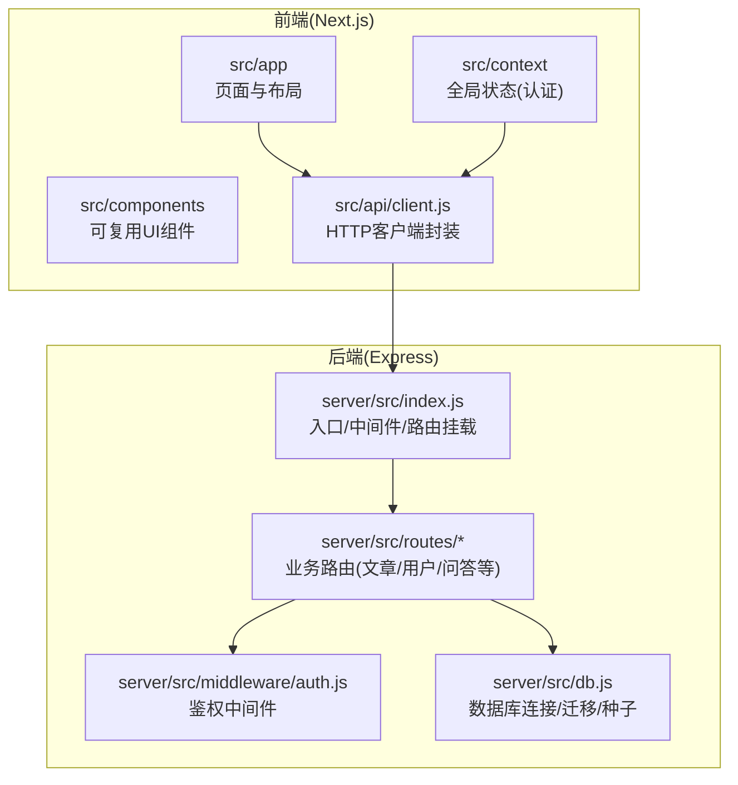
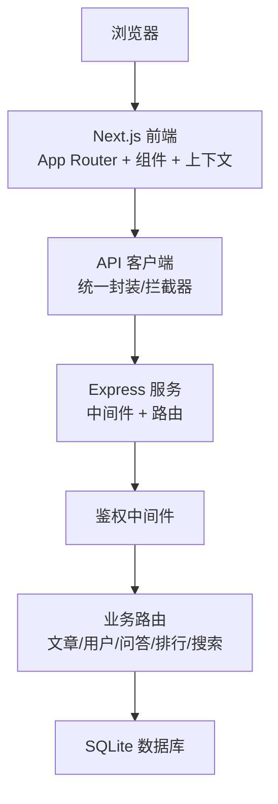
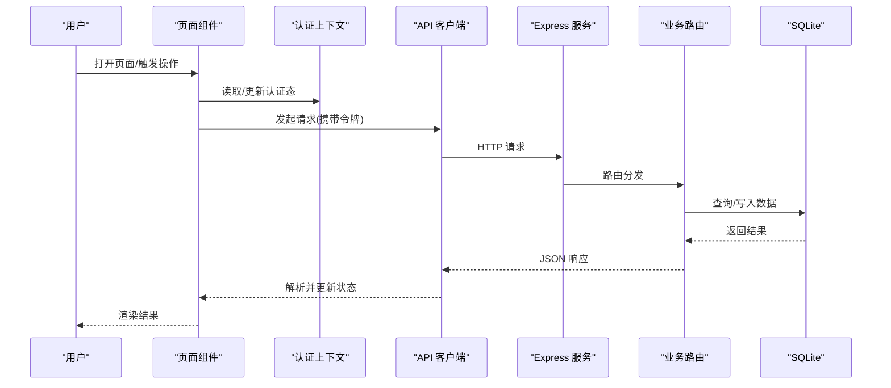
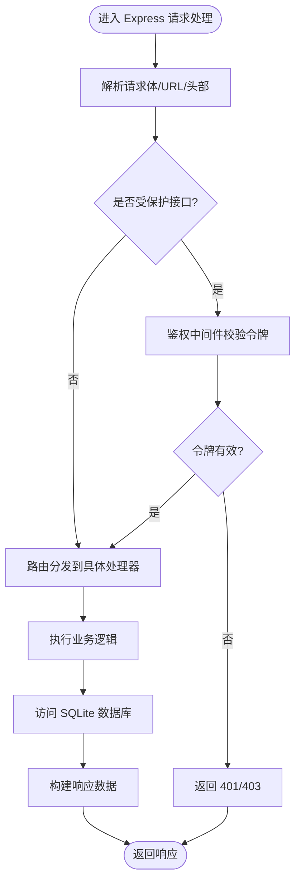
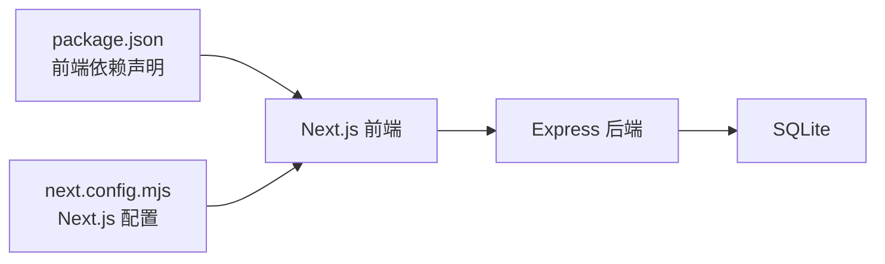

# 架构概览

<cite>
**本文引用的文件**
- [README.md](file://README.md)
- [package.json](file://package.json)
- [next.config.mjs](file://next.config.mjs)
- [server/src/index.js](file://server/src/index.js)
- [server/src/db.js](file://server/src/db.js)
- [server/src/middleware/auth.js](file://server/src/middleware/auth.js)
- [server/src/routes/posts.js](file://server/src/routes/posts.js)
- [server/src/routes/users.js](file://server/src/routes/users.js)
- [src/app/layout.jsx](file://src/app/layout.jsx)
- [src/app/page.jsx](file://src/app/page.jsx)
- [src/api/client.js](file://src/api/client.js)
- [src/context/AuthContext.tsx](file://src/context/AuthContext.tsx)
</cite>

## 目录
1. [简介](#简介)
2. [项目结构](#项目结构)
3. [核心组件](#核心组件)
4. [架构总览](#架构总览)
5. [详细组件分析](#详细组件分析)
6. [依赖关系分析](#依赖关系分析)
7. [性能考量](#性能考量)
8. [故障排查指南](#故障排查指南)
9. [结论](#结论)
10. [附录](#附录)

## 简介
本架构概览面向博客系统的前后端分离设计，重点说明 Next.js 前端与 Express 后端的职责划分、技术栈选择原因与优势、核心组件及其交互关系（客户端-服务器通信、数据流向、错误处理机制），并提供高层架构图以展示主要模块的协作方式。同时给出可扩展性设计与部署拓扑建议，帮助读者快速理解系统全貌并指导后续演进。

## 项目结构
仓库采用前后端同仓管理：
- 前端应用位于 src 目录，基于 Next.js App Router 组织页面与组件，提供路由、布局、上下文状态与 API 客户端封装。
- 后端服务位于 server 目录，基于 Express 提供 RESTful API，使用 SQLite 作为持久化存储，并通过中间件实现鉴权等横切能力。
- 根级配置文件包括 Next.js 配置、包管理与构建脚本等。

图表来源
- [src/app/layout.jsx](file://src/app/layout.jsx)
- [src/app/page.jsx](file://src/app/page.jsx)
- [src/api/client.js](file://src/api/client.js)
- [server/src/index.js](file://server/src/index.js)
- [server/src/routes/posts.js](file://server/src/routes/posts.js)
- [server/src/routes/users.js](file://server/src/routes/users.js)
- [server/src/middleware/auth.js](file://server/src/middleware/auth.js)
- [server/src/db.js](file://server/src/db.js)

章节来源
- [README.md](file://README.md)
- [package.json](file://package.json)
- [next.config.mjs](file://next.config.mjs)
- [server/src/index.js](file://server/src/index.js)
- [server/src/db.js](file://server/src/db.js)
- [src/app/layout.jsx](file://src/app/layout.jsx)
- [src/app/page.jsx](file://src/app/page.jsx)
- [src/api/client.js](file://src/api/client.js)

## 核心组件
- 前端应用层
  - 页面与布局：基于 Next.js App Router 的页面与全局布局，负责首屏渲染、SEO 元信息、主题与导航等。
  - 组件库：通用 UI 组件（卡片、列表、分页、搜索、评论等）提升复用性与一致性。
  - 全局状态：通过 React Context 维护认证态，统一登录/登出流程与权限判断。
  - API 客户端：集中封装 HTTP 请求、基础地址、拦截器（如携带令牌、统一错误提示）。
- 后端服务层
  - 服务入口：Express 应用初始化、静态资源、CORS、日志、错误处理中间件与路由挂载。
  - 路由层：按领域拆分（文章、用户、问答、排行、搜索等），承载业务逻辑与参数校验。
  - 鉴权中间件：解析令牌、校验身份与角色，保护受保护接口。
  - 数据访问：SQLite 连接、迁移与种子数据，为路由层提供稳定数据源。

章节来源
- [src/app/layout.jsx](file://src/app/layout.jsx)
- [src/app/page.jsx](file://src/app/page.jsx)
- [src/context/AuthContext.tsx](file://src/context/AuthContext.tsx)
- [src/api/client.js](file://src/api/client.js)
- [server/src/index.js](file://server/src/index.js)
- [server/src/middleware/auth.js](file://server/src/middleware/auth.js)
- [server/src/routes/posts.js](file://server/src/routes/posts.js)
- [server/src/routes/users.js](file://server/src/routes/users.js)
- [server/src/db.js](file://server/src/db.js)

## 架构总览
下图展示了前后端分离的整体架构与关键交互路径：浏览器发起请求，由 Next.js 前端渲染或调用 API；API 客户端将请求转发至 Express 后端；后端经鉴权中间件与路由处理，最终读写 SQLite 数据库。

图表来源
- [src/app/layout.jsx](file://src/app/layout.jsx)
- [src/app/page.jsx](file://src/app/page.jsx)
- [src/api/client.js](file://src/api/client.js)
- [server/src/index.js](file://server/src/index.js)
- [server/src/middleware/auth.js](file://server/src/middleware/auth.js)
- [server/src/routes/posts.js](file://server/src/routes/posts.js)
- [server/src/routes/users.js](file://server/src/routes/users.js)
- [server/src/db.js](file://server/src/db.js)

## 详细组件分析

### 前端应用（Next.js）
- 页面与布局
  - 通过 App Router 组织页面，layout 提供全局样式、导航与主题切换。
  - 页面根据路由加载对应内容，支持服务端渲染与客户端交互混合模式。
- 组件体系
  - 将高频 UI 抽象为独立组件，配合 CSS Modules 进行样式隔离。
- 全局状态（认证）
  - 使用 React Context 维护登录态、用户信息与权限，供各页面与组件消费。
- API 客户端
  - 统一封装 fetch/axios 调用，设置基础 URL、请求头（如 Authorization）、错误拦截与重试策略。

图表来源
- [src/app/page.jsx](file://src/app/page.jsx)
- [src/context/AuthContext.tsx](file://src/context/AuthContext.tsx)
- [src/api/client.js](file://src/api/client.js)
- [server/src/index.js](file://server/src/index.js)
- [server/src/routes/posts.js](file://server/src/routes/posts.js)
- [server/src/db.js](file://server/src/db.js)

章节来源
- [src/app/layout.jsx](file://src/app/layout.jsx)
- [src/app/page.jsx](file://src/app/page.jsx)
- [src/context/AuthContext.tsx](file://src/context/AuthContext.tsx)
- [src/api/client.js](file://src/api/client.js)

### 后端服务（Express）
- 服务入口
  - 初始化 Express 实例，注册全局中间件（CORS、JSON 解析、错误处理），挂载路由与静态资源。
- 鉴权中间件
  - 从请求头解析令牌，校验有效性并注入用户上下文，未通过则返回 401/403。
- 路由层
  - 按领域拆分路由文件，每个路由处理特定资源的增删改查与复杂查询。
- 数据访问
  - 通过 db.js 管理 SQLite 连接、执行 SQL 与事务，必要时执行迁移与种子数据。

图表来源
- [server/src/index.js](file://server/src/index.js)
- [server/src/middleware/auth.js](file://server/src/middleware/auth.js)
- [server/src/routes/posts.js](file://server/src/routes/posts.js)
- [server/src/routes/users.js](file://server/src/routes/users.js)
- [server/src/db.js](file://server/src/db.js)

章节来源
- [server/src/index.js](file://server/src/index.js)
- [server/src/middleware/auth.js](file://server/src/middleware/auth.js)
- [server/src/routes/posts.js](file://server/src/routes/posts.js)
- [server/src/routes/users.js](file://server/src/routes/users.js)
- [server/src/db.js](file://server/src/db.js)

### 客户端-服务器通信与错误处理
- 通信契约
  - 前端通过 API 客户端统一发起 REST 请求，约定基础路径、请求头与响应格式。
  - 后端路由遵循 REST 风格，返回标准 JSON 响应与状态码。
- 错误处理
  - 前端在 API 客户端中统一捕获网络异常与业务错误，提供用户可见提示。
  - 后端通过全局错误中间件捕获未处理异常，返回一致的错误结构。
  - 鉴权失败时返回明确的 401/403，便于前端区分未登录与无权限场景。

章节来源
- [src/api/client.js](file://src/api/client.js)
- [server/src/index.js](file://server/src/index.js)
- [server/src/middleware/auth.js](file://server/src/middleware/auth.js)

## 依赖关系分析
- 前端依赖
  - Next.js 框架与 React 生态，用于页面渲染、路由与组件化开发。
  - 包管理器与构建脚本由 package.json 定义，包含开发与生产依赖。
- 后端依赖
  - Express 作为 Web 框架，提供路由与中间件能力。
  - SQLite 作为轻量级嵌入式数据库，适合单进程/小规模部署场景。
- 耦合与内聚
  - 前后端通过 API 契约解耦，降低变更影响面。
  - 后端按领域拆分路由，提高内聚性；鉴权中间件横向切入，避免重复逻辑。

图表来源
- [package.json](file://package.json)
- [next.config.mjs](file://next.config.mjs)
- [server/src/index.js](file://server/src/index.js)
- [server/src/db.js](file://server/src/db.js)

章节来源
- [package.json](file://package.json)
- [next.config.mjs](file://next.config.mjs)
- [server/src/index.js](file://server/src/index.js)
- [server/src/db.js](file://server/src/db.js)

## 性能考量
- 前端
  - 利用 Next.js 的服务端渲染与增量静态生成，优化首屏加载与 SEO。
  - 组件按需加载与代码分割，减少初始包体积。
  - 对热点数据实施缓存策略（浏览器缓存、CDN、服务端缓存）。
- 后端
  - 使用连接池与索引优化提升 SQLite 查询性能。
  - 对写多读少场景考虑引入队列与异步任务。
  - 启用压缩与静态资源缓存，减少带宽占用。
- 部署
  - 前后端分离部署，前端走 CDN，后端水平扩展时结合负载均衡与无状态会话。

[本节为通用性能建议，不直接分析具体文件]

## 故障排查指南
- 常见问题定位
  - 网络与跨域：检查 CORS 配置与基础 URL 是否正确。
  - 鉴权失败：确认令牌是否存在、是否过期、是否携带在请求头中。
  - 数据库问题：检查 SQLite 文件权限、迁移是否成功、表结构是否与代码一致。
- 日志与监控
  - 在后端增加结构化日志，记录请求 ID、耗时与错误堆栈。
  - 在前端统一上报关键错误与性能指标，便于追踪问题。
- 恢复策略
  - 对关键接口实现幂等与重试，避免重复提交。
  - 定期备份 SQLite 数据文件，确保可回滚。

章节来源
- [server/src/index.js](file://server/src/index.js)
- [server/src/middleware/auth.js](file://server/src/middleware/auth.js)
- [server/src/db.js](file://server/src/db.js)
- [src/api/client.js](file://src/api/client.js)

## 结论
本博客系统采用前后端分离架构，前端基于 Next.js 提供高性能渲染与良好用户体验，后端基于 Express 提供清晰的 REST API 与稳定的数据访问。通过统一的 API 客户端与鉴权中间件，系统具备良好的可维护性与可扩展性。结合 SQLite 的轻量特性与合理的部署拓扑，可在中小规模场景下快速交付与迭代。未来可按需引入缓存、消息队列与微服务化改造，进一步提升性能与弹性。

[本节为总结性内容，不直接分析具体文件]

## 附录
- 技术栈选择与优势
  - React/Next.js：组件化与 SSR/SSG 能力，利于 SEO 与首屏性能。
  - Node.js/Express：轻量高效，生态丰富，易于前后端语言统一。
  - SQLite：零配置、单文件数据库，适合原型与小型站点。
- 部署拓扑建议
  - 前端部署于静态托管/CDN，后端部署于容器化环境，数据库文件本地或挂载卷。
  - 反向代理统一入口，HTTPS 终止，静态资源缓存命中。

[本节为概念性内容，不直接分析具体文件]