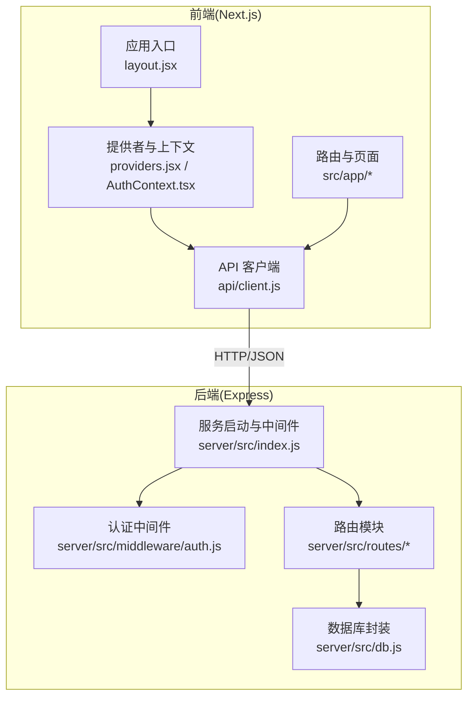
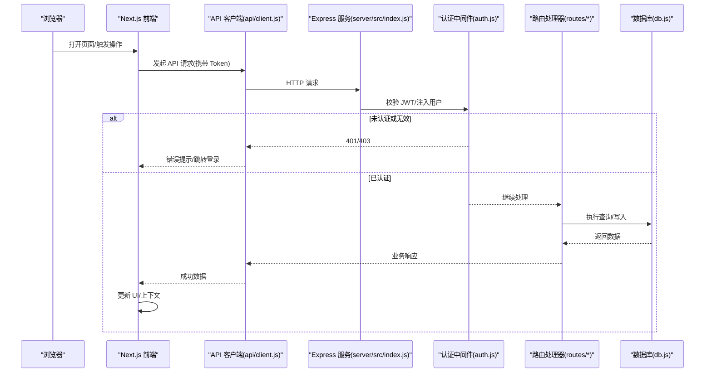
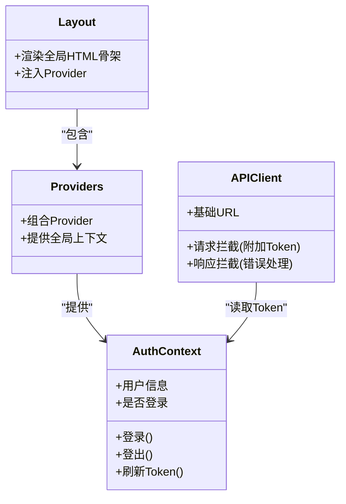
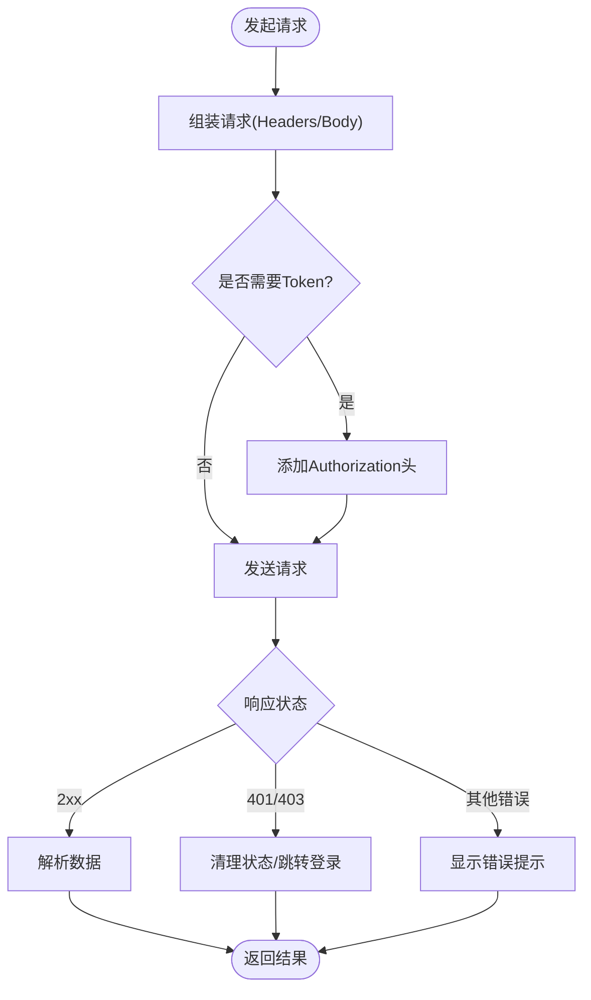
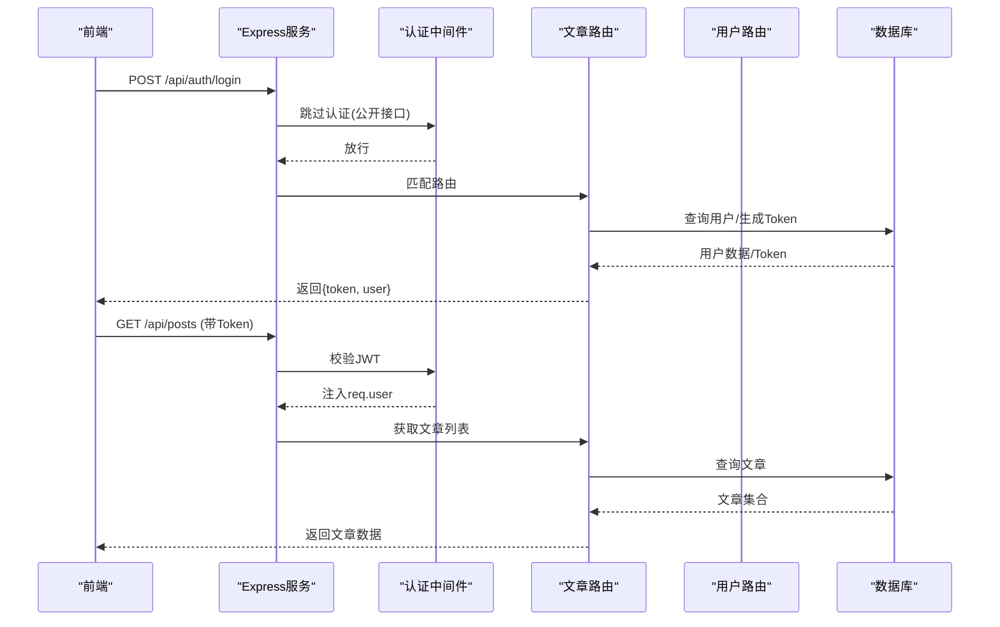
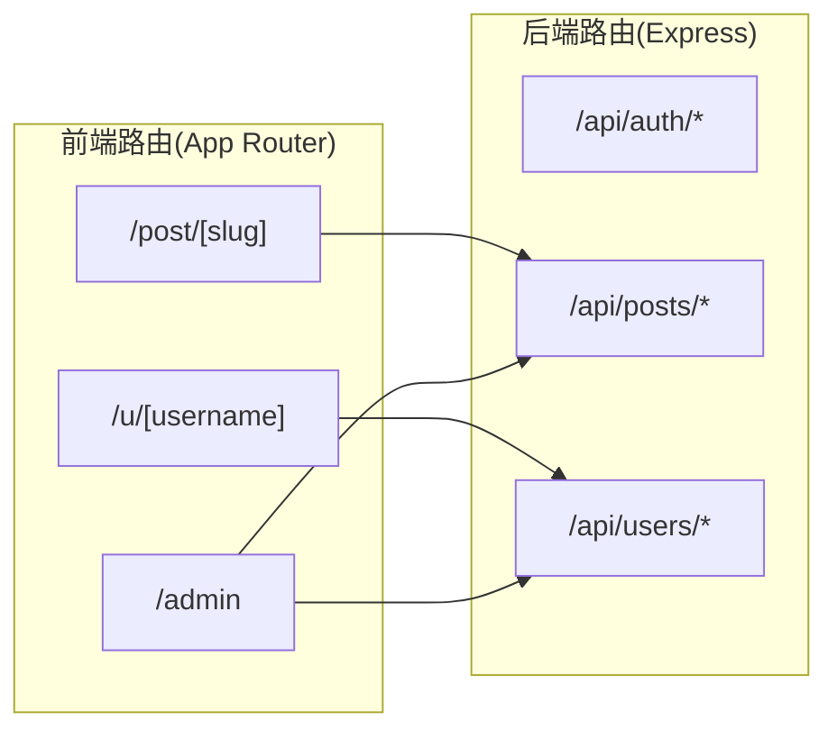
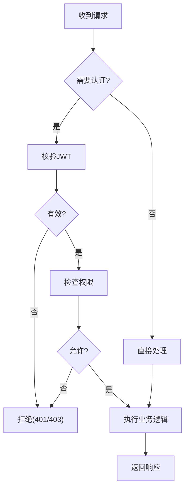
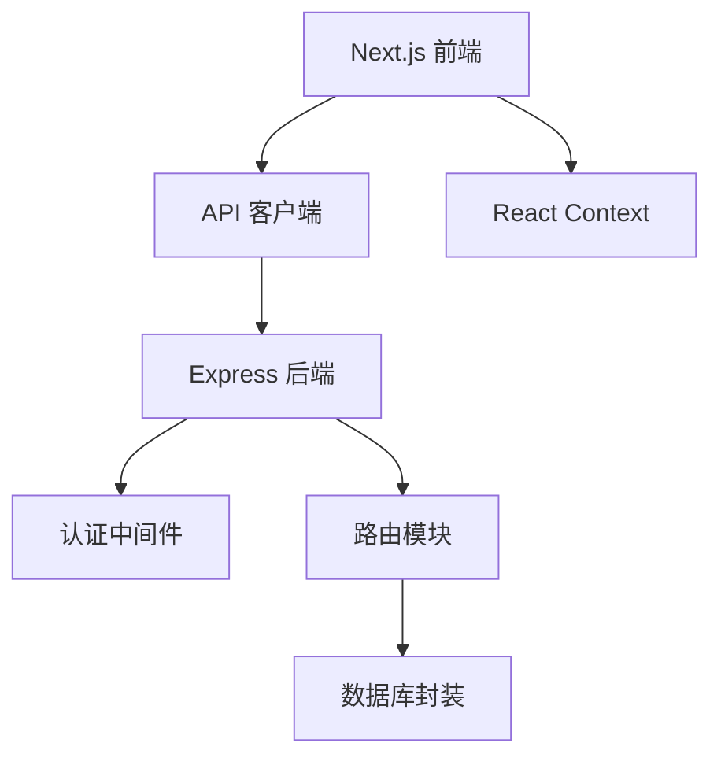

# 系统架构

<cite>
**本文引用的文件**   
- [server/src/index.js](file://server/src/index.js)
- [server/src/middleware/auth.js](file://server/src/middleware/auth.js)
- [server/src/routes/posts.js](file://server/src/routes/posts.js)
- [server/src/routes/users.js](file://server/src/routes/users.js)
- [server/src/routes/auth.js](file://server/src/routes/auth.js)
- [server/src/db.js](file://server/src/db.js)
- [src/app/layout.jsx](file://src/app/layout.jsx)
- [src/app/providers.jsx](file://src/app/providers.jsx)
- [src/context/AuthContext.tsx](file://src/context/AuthContext.tsx)
- [src/api/client.js](file://src/api/client.js)
- [next.config.mjs](file://next.config.mjs)
</cite>

## 目录
1. [简介](#简介)
2. [项目结构](#项目结构)
3. [核心组件](#核心组件)
4. [架构总览](#架构总览)
5. [详细组件分析](#详细组件分析)
6. [依赖关系分析](#依赖关系分析)
7. [性能考虑](#性能考虑)
8. [故障排查指南](#故障排查指南)
9. [结论](#结论)
10. [附录](#附录)

## 简介
本系统采用前后端分离的架构模式：前端基于 Next.js（App Router）构建，负责页面渲染、用户交互与状态管理；后端基于 Express 提供 RESTful API，负责业务逻辑、权限校验与数据持久化。两者通过 HTTP/JSON 通信，使用 JWT 进行认证与会话管理，数据库层由后端统一封装访问。

## 项目结构
- 前端（Next.js）
  - 应用入口与全局布局：layout.jsx、providers.jsx
  - 路由：app 目录下按功能划分的路由与页面
  - 状态管理：context/AuthContext.tsx 提供认证上下文
  - API 客户端：api/client.js 封装请求、拦截器与错误处理
  - 代理配置：next.config.mjs 将开发环境 API 请求转发至后端
- 后端（Express）
  - 服务启动与中间件注册：server/src/index.js
  - 认证中间件：server/src/middleware/auth.js
  - 路由模块：routes/*（posts、users、auth 等）
  - 数据库连接与查询封装：server/src/db.js

图表来源
- [src/app/layout.jsx](file://src/app/layout.jsx)
- [src/app/providers.jsx](file://src/app/providers.jsx)
- [src/context/AuthContext.tsx](file://src/context/AuthContext.tsx)
- [src/api/client.js](file://src/api/client.js)
- [server/src/index.js](file://server/src/index.js)
- [server/src/middleware/auth.js](file://server/src/middleware/auth.js)
- [server/src/routes/posts.js](file://server/src/routes/posts.js)
- [server/src/routes/users.js](file://server/src/routes/users.js)
- [server/src/routes/auth.js](file://server/src/routes/auth.js)
- [server/src/db.js](file://server/src/db.js)

章节来源
- [src/app/layout.jsx](file://src/app/layout.jsx)
- [src/app/providers.jsx](file://src/app/providers.jsx)
- [src/context/AuthContext.tsx](file://src/context/AuthContext.tsx)
- [src/api/client.js](file://src/api/client.js)
- [server/src/index.js](file://server/src/index.js)
- [server/src/middleware/auth.js](file://server/src/middleware/auth.js)
- [server/src/routes/posts.js](file://server/src/routes/posts.js)
- [server/src/routes/users.js](file://server/src/routes/users.js)
- [server/src/routes/auth.js](file://server/src/routes/auth.js)
- [server/src/db.js](file://server/src/db.js)

## 核心组件
- 前端应用壳与提供者
  - layout.jsx：定义全局 HTML 骨架、主题与根布局
  - providers.jsx：注入全局 Provider（如主题、国际化、认证上下文）
- 认证上下文
  - AuthContext.tsx：集中管理登录态、用户信息、登出与刷新令牌逻辑，供各页面与组件消费
- API 客户端
  - api/client.js：统一封装 fetch/axios 调用，设置基础 URL、请求头（含 Authorization）、响应拦截与错误提示
- 后端服务
  - index.js：初始化 Express、注册 CORS、解析 JSON、挂载路由与中间件
  - middleware/auth.js：JWT 校验、解析用户身份并注入到 req.user
  - routes/*：按领域拆分路由处理器，实现具体业务逻辑
  - db.js：数据库连接与通用查询方法封装

章节来源
- [src/app/layout.jsx](file://src/app/layout.jsx)
- [src/app/providers.jsx](file://src/app/providers.jsx)
- [src/context/AuthContext.tsx](file://src/context/AuthContext.tsx)
- [src/api/client.js](file://src/api/client.js)
- [server/src/index.js](file://server/src/index.js)
- [server/src/middleware/auth.js](file://server/src/middleware/auth.js)
- [server/src/routes/posts.js](file://server/src/routes/posts.js)
- [server/src/routes/users.js](file://server/src/routes/users.js)
- [server/src/routes/auth.js](file://server/src/routes/auth.js)
- [server/src/db.js](file://server/src/db.js)

## 架构总览
下图展示从浏览器发起请求到数据库操作的完整链路，包括认证、鉴权、路由分发与数据访问。

图表来源
- [src/api/client.js](file://src/api/client.js)
- [server/src/index.js](file://server/src/index.js)
- [server/src/middleware/auth.js](file://server/src/middleware/auth.js)
- [server/src/routes/posts.js](file://server/src/routes/posts.js)
- [server/src/routes/users.js](file://server/src/routes/users.js)
- [server/src/routes/auth.js](file://server/src/routes/auth.js)
- [server/src/db.js](file://server/src/db.js)

## 详细组件分析

### 前端应用与状态管理
- 应用壳与提供者
  - layout.jsx 定义全局布局与元信息，为所有页面提供一致的容器
  - providers.jsx 聚合各类 Provider，确保上下文在整棵组件树中可用
- 认证上下文(AuthContext.tsx)
  - 职责：维护登录态、用户信息、提供登录/登出/刷新令牌等方法
  - 通信：通过 React Context 向子组件广播状态变化
  - 集成：配合 API 客户端在请求前自动附加 Token，并在响应异常时引导重新登录

图表来源
- [src/app/layout.jsx](file://src/app/layout.jsx)
- [src/app/providers.jsx](file://src/app/providers.jsx)
- [src/context/AuthContext.tsx](file://src/context/AuthContext.tsx)
- [src/api/client.js](file://src/api/client.js)

章节来源
- [src/app/layout.jsx](file://src/app/layout.jsx)
- [src/app/providers.jsx](file://src/app/providers.jsx)
- [src/context/AuthContext.tsx](file://src/context/AuthContext.tsx)
- [src/api/client.js](file://src/api/client.js)

### API 客户端封装
- 统一基础地址与超时配置
- 请求拦截：自动附加 Authorization 头（Bearer Token）
- 响应拦截：统一处理 401/403 等错误，必要时清空本地状态并跳转登录
- 错误提示：结合 Toast 或全局提示机制反馈给用户

图表来源
- [src/api/client.js](file://src/api/client.js)

章节来源
- [src/api/client.js](file://src/api/client.js)

### 后端服务与中间件
- 服务启动(index.js)
  - 初始化 Express、CORS、JSON 解析
  - 挂载全局中间件与路由
- 认证中间件(auth.js)
  - 校验请求头中的 JWT
  - 解析用户信息并挂载到 req.user
  - 对未认证或无效 Token 返回 401/403
- 路由模块(routes/*)
  - posts.js：文章相关接口（列表、详情、创建、更新、删除等）
  - users.js：用户相关接口（资料、关注、收藏等）
  - auth.js：登录、注册、刷新令牌等认证接口

图表来源
- [server/src/index.js](file://server/src/index.js)
- [server/src/middleware/auth.js](file://server/src/middleware/auth.js)
- [server/src/routes/posts.js](file://server/src/routes/posts.js)
- [server/src/routes/users.js](file://server/src/routes/users.js)
- [server/src/routes/auth.js](file://server/src/routes/auth.js)
- [server/src/db.js](file://server/src/db.js)

章节来源
- [server/src/index.js](file://server/src/index.js)
- [server/src/middleware/auth.js](file://server/src/middleware/auth.js)
- [server/src/routes/posts.js](file://server/src/routes/posts.js)
- [server/src/routes/users.js](file://server/src/routes/users.js)
- [server/src/routes/auth.js](file://server/src/routes/auth.js)
- [server/src/db.js](file://server/src/db.js)

### 路由系统设计
- 前端路由（Next.js App Router）
  - 以 src/app 下的目录组织路由，支持动态段与嵌套布局
  - 页面级组件负责数据获取与渲染，可与服务端渲染/客户端渲染策略结合
- 后端路由（Express）
  - 按领域拆分为多个路由文件，便于维护与扩展
  - 公共接口（如登录）不经过认证中间件，受保护接口需携带有效 JWT

图表来源
- [src/app/post/[slug]/page.jsx](file://src/app/post/[slug]/page.jsx)
- [src/app/u/[username]/page.jsx](file://src/app/u/[username]/page.jsx)
- [src/app/admin/page.tsx](file://src/app/admin/page.tsx)
- [server/src/routes/auth.js](file://server/src/routes/auth.js)
- [server/src/routes/posts.js](file://server/src/routes/posts.js)
- [server/src/routes/users.js](file://server/src/routes/users.js)

章节来源
- [src/app/post/[slug]/page.jsx](file://src/app/post/[slug]/page.jsx)
- [src/app/u/[username]/page.jsx](file://src/app/u/[username]/page.jsx)
- [src/app/admin/page.tsx](file://src/app/admin/page.tsx)
- [server/src/routes/auth.js](file://server/src/routes/auth.js)
- [server/src/routes/posts.js](file://server/src/routes/posts.js)
- [server/src/routes/users.js](file://server/src/routes/users.js)

### 安全架构
- 认证与会话
  - 登录成功后后端签发 JWT，前端保存在内存或安全存储，后续请求自动附带
  - 敏感操作需校验 JWT，未认证或过期返回 401/403
- 权限控制
  - 基于角色或资源归属判断（例如管理员、作者、普通用户）
  - 路由层根据 req.user 决定允许的操作
- 输入验证
  - 在后端对关键参数进行校验（类型、长度、格式），避免注入与越权
- 传输安全
  - 生产环境启用 HTTPS，Cookie 标记 Secure/HttpOnly（若使用 Cookie 存储 Token）

图表来源
- [server/src/middleware/auth.js](file://server/src/middleware/auth.js)
- [server/src/routes/posts.js](file://server/src/routes/posts.js)
- [server/src/routes/users.js](file://server/src/routes/users.js)
- [server/src/routes/auth.js](file://server/src/routes/auth.js)

章节来源
- [server/src/middleware/auth.js](file://server/src/middleware/auth.js)
- [server/src/routes/posts.js](file://server/src/routes/posts.js)
- [server/src/routes/users.js](file://server/src/routes/users.js)
- [server/src/routes/auth.js](file://server/src/routes/auth.js)

## 依赖关系分析
- 前端依赖
  - Next.js 框架与 App Router
  - React Context 用于跨组件状态共享
  - API 客户端依赖网络库（fetch/axios）与错误处理工具
- 后端依赖
  - Express 作为 Web 服务器
  - JWT 库用于签发与校验令牌
  - 数据库驱动与连接池（由 db.js 封装）
- 耦合与内聚
  - 前后端通过稳定的 API 契约解耦
  - 后端按领域拆分路由，提升内聚性
  - 认证中间件集中处理安全逻辑，降低重复代码

图表来源
- [src/api/client.js](file://src/api/client.js)
- [src/context/AuthContext.tsx](file://src/context/AuthContext.tsx)
- [server/src/index.js](file://server/src/index.js)
- [server/src/middleware/auth.js](file://server/src/middleware/auth.js)
- [server/src/routes/posts.js](file://server/src/routes/posts.js)
- [server/src/db.js](file://server/src/db.js)

章节来源
- [src/api/client.js](file://src/api/client.js)
- [src/context/AuthContext.tsx](file://src/context/AuthContext.tsx)
- [server/src/index.js](file://server/src/index.js)
- [server/src/middleware/auth.js](file://server/src/middleware/auth.js)
- [server/src/routes/posts.js](file://server/src/routes/posts.js)
- [server/src/db.js](file://server/src/db.js)

## 性能考虑
- 前端
  - 利用 Next.js 的静态生成与增量再生成减少首屏时间
  - 合理拆分组件与懒加载，避免不必要的重渲染
  - 缓存策略：对热点数据使用 SWR/React Query 或浏览器缓存
- 后端
  - 连接池与索引优化，减少慢查询
  - 分页与字段裁剪，避免传输冗余数据
  - 限流与幂等设计，防止滥用与重复提交
- 传输
  - 开启 gzip/brotli 压缩
  - 合理使用 CDN 与静态资源缓存

[本节为通用指导，无需引用具体文件]

## 故障排查指南
- 认证失败
  - 检查请求是否携带正确的 Authorization 头
  - 确认 JWT 未过期且签名正确
  - 查看后端日志与中间件返回码
- 权限不足
  - 核对当前用户角色与目标资源的权限规则
  - 检查路由层权限判断逻辑
- 网络与代理
  - 开发环境确认 next.config.mjs 的代理配置是否正确指向后端
  - 生产环境检查反向代理与 HTTPS 证书
- 数据库问题
  - 检查连接字符串与权限
  - 查看慢查询日志与索引命中情况

章节来源
- [server/src/middleware/auth.js](file://server/src/middleware/auth.js)
- [server/src/index.js](file://server/src/index.js)
- [next.config.mjs](file://next.config.mjs)
- [server/src/db.js](file://server/src/db.js)

## 结论
本博客系统采用清晰的前后端分离架构：Next.js 负责页面与交互，Express 提供稳定可靠的 API 服务。通过统一的 API 客户端与 React Context 管理认证状态，结合 JWT 中间件实现安全的访问控制。模块化路由与数据库封装提升了可维护性与扩展性。建议在生产环境中完善监控、限流与审计能力，进一步提升系统的稳定性与安全性。

[本节为总结性内容，无需引用具体文件]

## 附录
- 环境变量与配置
  - 后端：数据库连接、JWT 密钥、端口等
  - 前端：API 基础地址、代理配置
- 部署建议
  - 前端静态站点托管（Vercel/CDN）
  - 后端容器化部署（Docker/Kubernetes）
  - 数据库独立部署与备份策略

[本节为补充说明，无需引用具体文件]