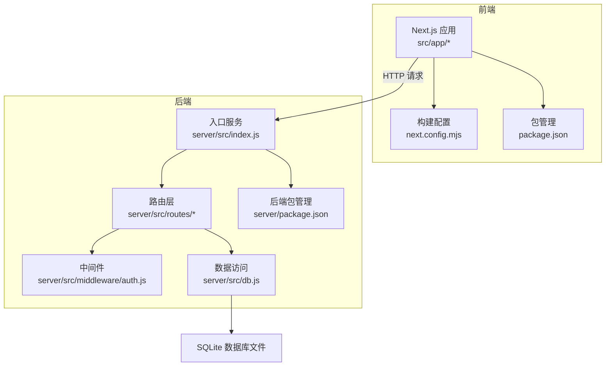
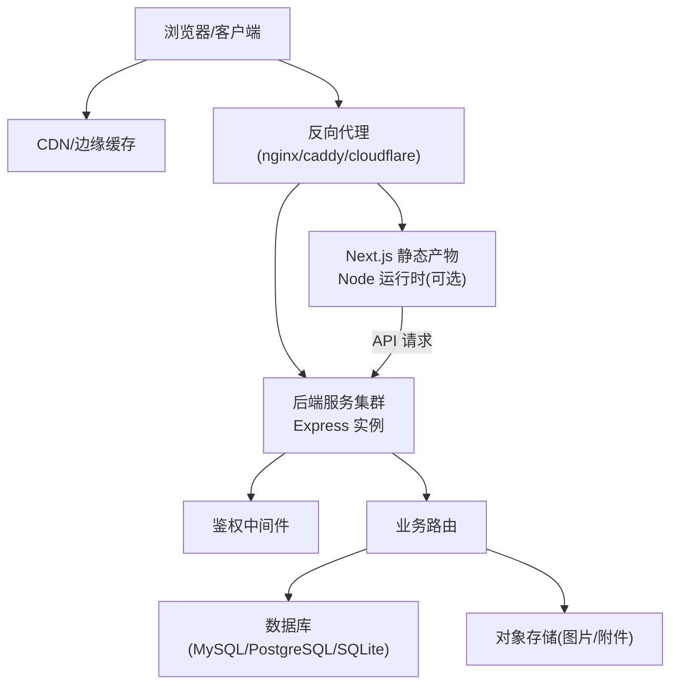
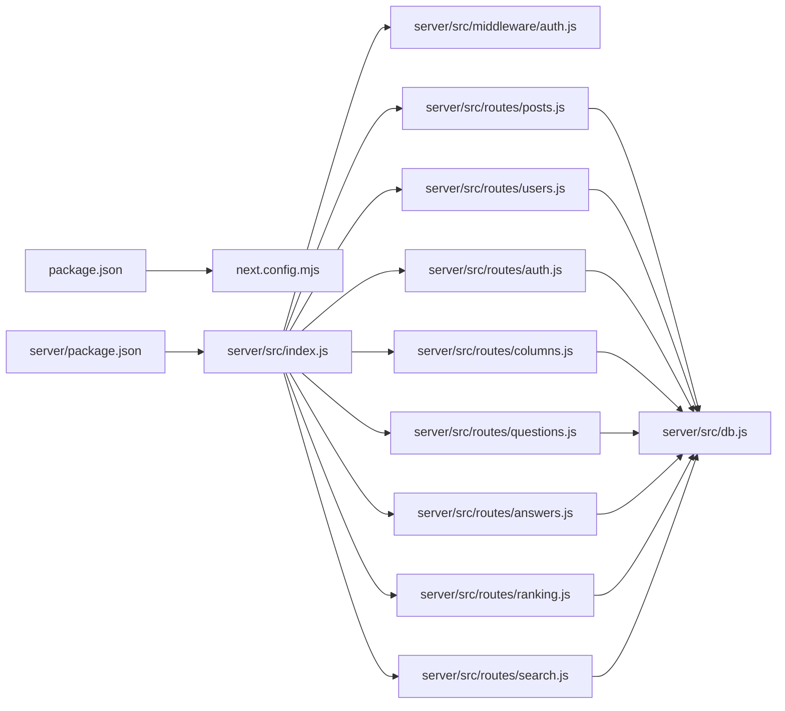

# 部署指南

<cite>
**本文引用的文件**   
- [README.md](file://README.md)
- [package.json](file://package.json)
- [next.config.mjs](file://next.config.mjs)
- [server/package.json](file://server/package.json)
- [server/src/index.js](file://server/src/index.js)
- [server/src/db.js](file://server/src/db.js)
- [server/src/middleware/auth.js](file://server/src/middleware/auth.js)
- [server/src/routes/posts.js](file://server/src/routes/posts.js)
- [server/src/routes/auth.js](file://server/src/routes/auth.js)
- [server/src/routes/users.js](file://server/src/routes/users.js)
- [server/src/routes/columns.js](file://server/src/routes/columns.js)
- [server/src/routes/questions.js](file://server/src/routes/questions.js)
- [server/src/routes/answers.js](file://server/src/routes/answers.js)
- [server/src/routes/ranking.js](file://server/src/routes/ranking.js)
- [server/src/routes/search.js](file://server/src/routes/search.js)
</cite>

## 目录
1. [简介](#简介)
2. [项目结构](#项目结构)
3. [核心组件](#核心组件)
4. [架构总览](#架构总览)
5. [详细组件分析](#详细组件分析)
6. [依赖分析](#依赖分析)
7. [性能考虑](#性能考虑)
8. [故障排查指南](#故障排查指南)
9. [结论](#结论)
10. [附录](#附录)

## 简介
本指南面向生产环境，提供博客系统的多种部署方案与运维实践。内容涵盖：
- 传统服务器部署、容器化部署、云平台部署的配置要点
- 环境变量管理与敏感信息保护
- 构建优化（代码压缩、资源优化、CDN）
- SSL/HTTPS 配置
- 数据库生产配置与备份策略
- 监控与日志收集
- 性能调优与容量规划
- 故障排查与运维最佳实践

## 项目结构
本项目采用前后端分离的 Next.js + Node.js 后端架构：
- 前端：Next.js 应用，负责页面渲染、静态资源与 API 客户端调用
- 后端：Express 风格的服务，提供认证、文章、问答、用户等接口，使用 SQLite 作为默认存储
- 构建产物：通过 Next.js 构建生成可运行产物，后端服务独立启动

图表来源
- [next.config.mjs:1-200](file://next.config.mjs#L1-L200)
- [package.json:1-200](file://package.json#L1-L200)
- [server/src/index.js:1-200](file://server/src/index.js#L1-L200)
- [server/src/db.js:1-200](file://server/src/db.js#L1-L200)
- [server/package.json:1-200](file://server/package.json#L1-L200)

章节来源
- [README.md:1-200](file://README.md#L1-L200)
- [package.json:1-200](file://package.json#L1-L200)
- [next.config.mjs:1-200](file://next.config.mjs#L1-L200)
- [server/src/index.js:1-200](file://server/src/index.js#L1-L200)
- [server/src/db.js:1-200](file://server/src/db.js#L1-L200)
- [server/package.json:1-200](file://server/package.json#L1-L200)

## 核心组件
- 前端构建与运行
  - 构建脚本与依赖定义位于根目录包管理文件中
  - 构建配置位于 next.config.mjs，控制输出格式、路径重写、代理等
- 后端服务
  - 入口服务在 server/src/index.js，加载路由与中间件
  - 路由模块集中在 server/src/routes/*，按功能域划分
  - 鉴权中间件在 server/src/middleware/auth.js
  - 数据访问封装在 server/src/db.js，默认使用 SQLite
- 数据库
  - 默认使用 SQLite 文件存储，适合中小规模场景；生产建议迁移至 MySQL/PostgreSQL 并调整连接参数

章节来源
- [package.json:1-200](file://package.json#L1-L200)
- [next.config.mjs:1-200](file://next.config.mjs#L1-L200)
- [server/src/index.js:1-200](file://server/src/index.js#L1-L200)
- [server/src/middleware/auth.js:1-200](file://server/src/middleware/auth.js#L1-L200)
- [server/src/db.js:1-200](file://server/src/db.js#L1-L200)
- [server/package.json:1-200](file://server/package.json#L1-L200)

## 架构总览
下图展示了生产环境的典型部署拓扑：反向代理统一入口，前端静态资源由 CDN 或边缘缓存加速，后端多实例水平扩展，共享外部数据库与对象存储。

图表来源
- [server/src/index.js:1-200](file://server/src/index.js#L1-L200)
- [server/src/middleware/auth.js:1-200](file://server/src/middleware/auth.js#L1-L200)
- [server/src/db.js:1-200](file://server/src/db.js#L1-L200)

## 详细组件分析

### 传统服务器部署（裸机/VPS）
- 前置准备
  - 安装 Node.js LTS 与包管理器
  - 安装反向代理（如 nginx/caddy），用于 HTTPS 终止与静态资源缓存
- 构建与产物
  - 执行前端构建命令，生成静态资源与可选的 Node 运行时产物
  - 将构建产物部署到服务器指定目录
- 后端服务
  - 安装后端依赖，初始化数据库（若为 SQLite，确保持久化目录挂载）
  - 以进程守护方式运行后端（systemd/pm2），设置开机自启与健康检查
- 环境变量
  - 通过系统级环境变量注入数据库连接、密钥、端口等
  - 避免在仓库中提交敏感信息
- 反向代理
  - 配置域名、SSL 证书、静态资源缓存头、后端上游转发
- 安全加固
  - 最小权限原则运行服务账户
  - 限制上传目录写入范围，启用访问白名单（必要时）

章节来源
- [server/src/index.js:1-200](file://server/src/index.js#L1-L200)
- [server/src/db.js:1-200](file://server/src/db.js#L1-L200)
- [next.config.mjs:1-200](file://next.config.mjs#L1-L200)

### 容器化部署（Docker/Kubernetes）
- Docker 镜像
  - 多阶段构建：先构建前端静态资源，再打包后端依赖与产物
  - 仅包含运行所需依赖，减小镜像体积
- 编排与配置
  - 使用 Compose 或 Helm Chart 编排服务
  - 通过 ConfigMap/Secret 注入环境变量与证书
- 健康检查与滚动更新
  - 配置就绪探针与存活探针，支持蓝绿/灰度发布
- 存储与持久化
  - 数据库卷挂载；若使用 SQLite，需确保单写并发与锁策略
- 网络与安全
  - 内部服务间走内网；对外暴露仅反向代理
  - 使用 Secret 管理密钥，定期轮换

章节来源
- [server/src/index.js:1-200](file://server/src/index.js#L1-L200)
- [server/src/db.js:1-200](file://server/src/db.js#L1-L200)
- [next.config.mjs:1-200](file://next.config.mjs#L1-L200)

### 云平台部署（Serverless/托管平台）
- 选择托管平台（如 Vercel/Cloudflare Pages/AWS/GCP）
  - 前端静态站点可直接托管，开启 CDN 与边缘缓存
  - 后端可使用 Serverless Functions 或容器托管
- 环境变量与密钥
  - 通过控制台或 CI/CD 注入环境变量
- 数据库
  - 使用云托管数据库，关闭公网访问，仅允许内网连通
- 自动扩缩容
  - 根据流量自动扩容，结合缓存降低后端压力

章节来源
- [next.config.mjs:1-200](file://next.config.mjs#L1-L200)
- [server/src/index.js:1-200](file://server/src/index.js#L1-L200)

### 环境变量与敏感信息管理
- 推荐变量清单
  - 数据库连接：主机、端口、用户名、密码、库名、SSL 开关
  - 应用端口、日志级别、跨域白名单、JWT 密钥、第三方服务密钥
- 管理方式
  - 本地开发：使用 .env 文件（不提交到版本库）
  - 生产环境：通过系统环境变量、容器 Secret、云平台密钥管理服务
- 校验与回退
  - 启动时校验必要变量，缺失则拒绝启动
  - 对可选变量提供合理默认值

章节来源
- [server/src/db.js:1-200](file://server/src/db.js#L1-L200)
- [server/src/middleware/auth.js:1-200](file://server/src/middleware/auth.js#L1-L200)

### 构建优化与 CDN 配置
- 代码与资源优化
  - 启用生产模式构建，开启代码分割与 Tree Shaking
  - 图片与字体进行压缩与懒加载
- 缓存策略
  - 静态资源使用强缓存与版本号命名
  - HTML 页面短缓存或无缓存，保证热更新
- CDN 接入
  - 将静态资源指向 CDN 域名，配置回源规则与缓存命中条件
  - 开启 Gzip/Brotli 压缩与 HTTP/2 或 HTTP/3

章节来源
- [next.config.mjs:1-200](file://next.config.mjs#L1-L200)
- [package.json:1-200](file://package.json#L1-L200)

### SSL 证书与 HTTPS 安全
- 证书获取与续期
  - 使用 Let's Encrypt 自动化签发与续期
- 反向代理配置
  - 强制 HTTPS，启用 HSTS、安全头（X-Frame-Options、CSP 等）
  - 配置 TLS 版本与加密套件，禁用不安全协议
- 传输安全
  - 后端与数据库之间启用 TLS（如云数据库要求）

章节来源
- [server/src/index.js:1-200](file://server/src/index.js#L1-L200)

### 数据库生产配置与备份策略
- 引擎选择
  - 小规模：SQLite（注意并发与锁）
  - 中大规模：MySQL/PostgreSQL（主从/读写分离）
- 连接池与超时
  - 合理设置连接池大小、查询超时、重试策略
- 索引与查询优化
  - 针对高频查询建立索引，避免全表扫描
- 备份与恢复
  - 定时全量与增量备份，异地容灾
  - 定期演练恢复流程，验证备份有效性

章节来源
- [server/src/db.js:1-200](file://server/src/db.js#L1-L200)

### 监控与日志收集
- 指标采集
  - 应用指标：QPS、延迟、错误率、内存/CPU 使用率
  - 基础设施指标：磁盘、网络、数据库连接数
- 日志规范
  - 结构化 JSON 日志，包含请求 ID、用户标识、耗时
  - 集中式日志收集（ELK/Loki），保留策略与脱敏
- 告警与追踪
  - 基于阈值与异常模式触发告警
  - 分布式链路追踪定位慢请求

章节来源
- [server/src/index.js:1-200](file://server/src/index.js#L1-L200)

### 性能调优与容量规划
- 前端
  - 预渲染/SSR 按需开启，首屏关键资源内联
  - 图片 WebP/AVIF、懒加载、CDN 边缘缓存
- 后端
  - 水平扩展多实例，配合负载均衡
  - 热点数据缓存（Redis），减少数据库压力
- 容量规划
  - 压测确定峰值 QPS 与资源需求，预留冗余
  - 分库分表与读写分离应对增长

章节来源
- [next.config.mjs:1-200](file://next.config.mjs#L1-L200)
- [server/src/index.js:1-200](file://server/src/index.js#L1-L200)

### 故障排查与运维最佳实践
- 快速定位
  - 通过请求 ID 关联日志与追踪
  - 关注错误率突增、延迟尖峰、资源水位告警
- 常见故障
  - 数据库连接失败：检查连接串、权限、网络 ACL
  - 静态资源 404：确认构建产物与 CDN 回源配置
  - 鉴权失败：核对 JWT 密钥与环境变量一致性
- 变更与回滚
  - 灰度发布与一键回滚，变更前备份数据库
  - 变更窗口与通知机制

章节来源
- [server/src/middleware/auth.js:1-200](file://server/src/middleware/auth.js#L1-L200)
- [server/src/db.js:1-200](file://server/src/db.js#L1-L200)

## 依赖分析
- 前端依赖
  - 构建与运行依赖由 package.json 管理
  - 构建配置由 next.config.mjs 控制
- 后端依赖
  - 后端依赖由 server/package.json 管理
  - 入口服务与路由、中间件、数据访问分层清晰

图表来源
- [package.json:1-200](file://package.json#L1-L200)
- [next.config.mjs:1-200](file://next.config.mjs#L1-L200)
- [server/package.json:1-200](file://server/package.json#L1-L200)
- [server/src/index.js:1-200](file://server/src/index.js#L1-L200)
- [server/src/db.js:1-200](file://server/src/db.js#L1-L200)
- [server/src/middleware/auth.js:1-200](file://server/src/middleware/auth.js#L1-L200)
- [server/src/routes/posts.js:1-200](file://server/src/routes/posts.js#L1-L200)
- [server/src/routes/users.js:1-200](file://server/src/routes/users.js#L1-L200)
- [server/src/routes/auth.js:1-200](file://server/src/routes/auth.js#L1-L200)
- [server/src/routes/columns.js:1-200](file://server/src/routes/columns.js#L1-L200)
- [server/src/routes/questions.js:1-200](file://server/src/routes/questions.js#L1-L200)
- [server/src/routes/answers.js:1-200](file://server/src/routes/answers.js#L1-L200)
- [server/src/routes/ranking.js:1-200](file://server/src/routes/ranking.js#L1-L200)
- [server/src/routes/search.js:1-200](file://server/src/routes/search.js#L1-L200)

章节来源
- [package.json:1-200](file://package.json#L1-L200)
- [next.config.mjs:1-200](file://next.config.mjs#L1-L200)
- [server/package.json:1-200](file://server/package.json#L1-L200)
- [server/src/index.js:1-200](file://server/src/index.js#L1-L200)

## 性能考虑
- 前端
  - 启用生产构建与代码分割，减少首屏体积
  - 静态资源上 CDN，开启压缩与缓存
- 后端
  - 多实例水平扩展，负载均衡分发
  - 热点查询加缓存，数据库连接池调优
- 数据库
  - 索引优化、慢查询治理、读写分离
- 容量规划
  - 压测评估峰值，预留 30%-50% 冗余
  - 弹性伸缩策略与降级预案

[本节为通用指导，无需源码引用]

## 故障排查指南
- 日志与追踪
  - 统一日志格式，关联请求 ID
  - 集中收集与检索，设置保留周期
- 常见问题
  - 数据库连接失败：检查连接参数、网络 ACL、账号权限
  - 静态资源 404：确认构建产物路径与 CDN 回源
  - 鉴权失败：核对密钥与环境变量
- 应急处理
  - 快速回滚、隔离故障节点、限流降级
  - 事后复盘与改进措施

章节来源
- [server/src/middleware/auth.js:1-200](file://server/src/middleware/auth.js#L1-L200)
- [server/src/db.js:1-200](file://server/src/db.js#L1-L200)

## 结论
通过合理的构建优化、反向代理与 HTTPS 配置、数据库生产化改造、完善的监控与日志体系，以及科学的容量规划与故障排查流程，博客系统可在生产环境中稳定、高效地运行。建议优先实现基础能力（环境变量、HTTPS、备份、监控），再逐步引入缓存、读写分离与弹性伸缩。

[本节为总结性内容，无需源码引用]

## 附录
- 部署清单
  - 域名与 DNS、SSL 证书、反向代理、前端静态资源、后端服务、数据库、对象存储、监控与日志
- 变更流程
  - 灰度发布、回滚策略、变更窗口、通知机制
- 安全基线
  - 最小权限、密钥轮换、安全头、输入校验与输出编码

[本节为补充说明，无需源码引用]