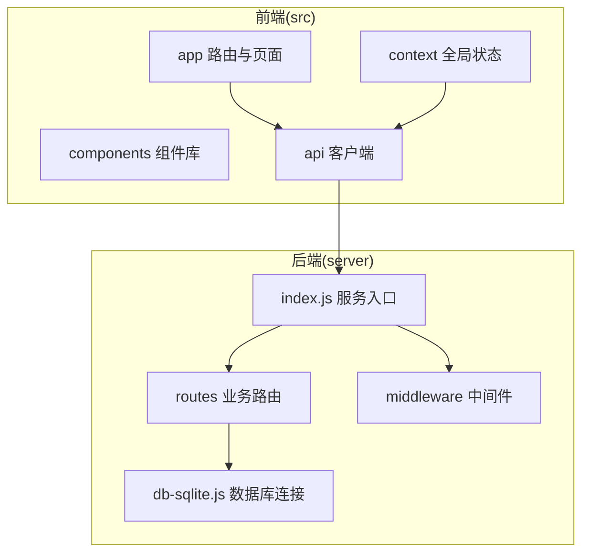
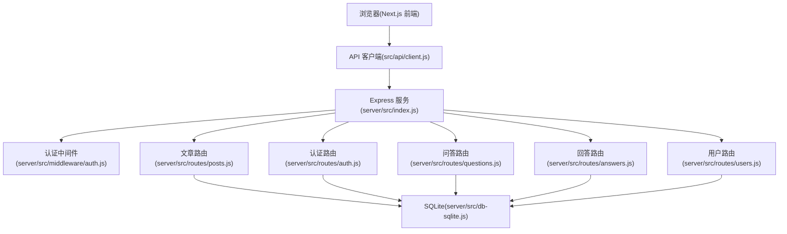
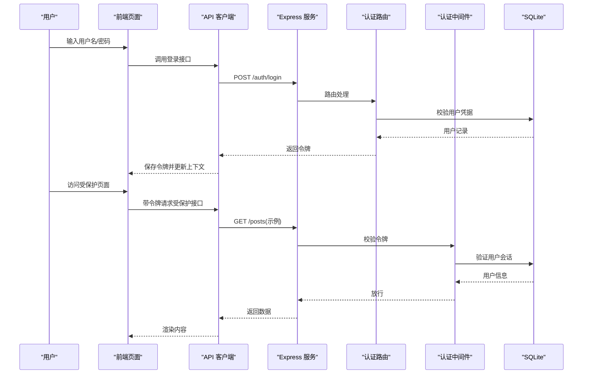
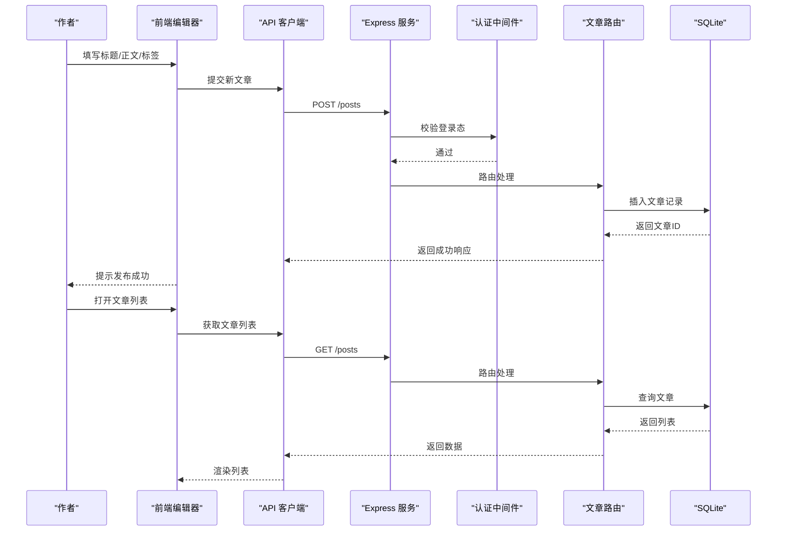
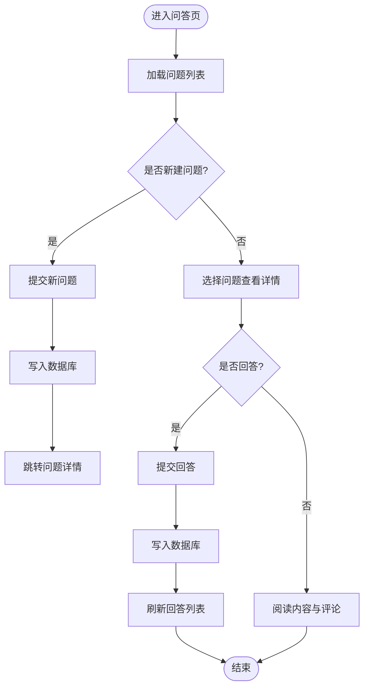
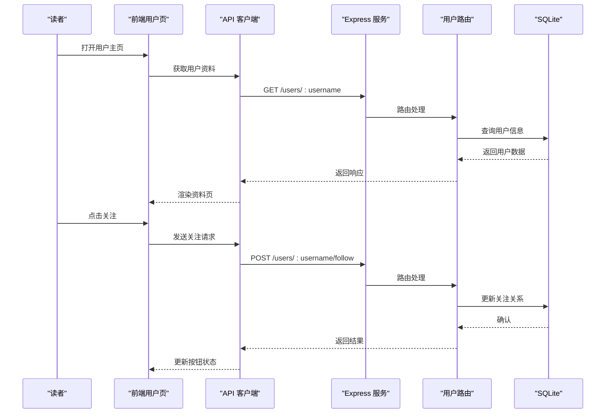
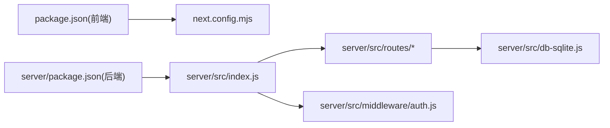

# 项目概述

<cite>
**本文引用的文件**   
- [README.md](file://README.md)
- [package.json](file://package.json)
- [next.config.mjs](file://next.config.mjs)
- [server/package.json](file://server/package.json)
- [server/src/index.js](file://server/src/index.js)
- [server/src/db-sqlite.js](file://server/src/db-sqlite.js)
- [server/src/middleware/auth.js](file://server/src/middleware/auth.js)
- [server/src/routes/posts.js](file://server/src/routes/posts.js)
- [server/src/routes/auth.js](file://server/src/routes/auth.js)
- [server/src/routes/questions.js](file://server/src/routes/questions.js)
- [server/src/routes/answers.js](file://server/src/routes/answers.js)
- [server/src/routes/users.js](file://server/src/routes/users.js)
- [src/app/layout.jsx](file://src/app/layout.jsx)
- [src/app/page.jsx](file://src/app/page.jsx)
- [src/app/providers.jsx](file://src/app/providers.jsx)
- [src/api/client.js](file://src/api/client.js)
- [src/context/AuthContext.tsx](file://src/context/AuthContext.tsx)
</cite>

## 目录
1. [简介](#简介)
2. [项目结构](#项目结构)
3. [核心组件](#核心组件)
4. [架构总览](#架构总览)
5. [详细组件分析](#详细组件分析)
6. [依赖关系分析](#依赖关系分析)
7. [性能考量](#性能考量)
8. [故障排查指南](#故障排查指南)
9. [结论](#结论)
10. [附录](#附录)

## 简介
本项目是一个基于 Next.js 与 Node.js 的全栈博客平台，提供文章发布、用户认证、问答系统、评论互动等核心能力。前端采用 React 组件化架构与 App Router 路由组织，后端以 Express 提供 RESTful API，数据持久化使用 SQLite，便于本地开发与快速部署。整体设计遵循前后端分离原则，通过统一的 API 客户端进行通信，并通过上下文管理用户认证状态。

技术选型要点：
- 前端：Next.js（App Router）、React 组件化、模块化样式与布局
- 后端：Express 路由分层、中间件鉴权、SQLite 轻量数据库
- 全栈协作：统一 API 客户端封装、全局认证上下文

## 项目结构
仓库采用“前后端同仓”的常见组织方式：
- 前端代码位于 src 目录，包含页面、组件、API 客户端与全局上下文
- 后端服务位于 server 目录，包含入口、路由、中间件与数据库脚本
- 根级配置文件包括 Next.js 配置、包管理与构建相关设置

图表来源
- [src/app/layout.jsx:1-200](file://src/app/layout.jsx#L1-L200)
- [src/app/page.jsx:1-200](file://src/app/page.jsx#L1-L200)
- [src/api/client.js:1-200](file://src/api/client.js#L1-L200)
- [src/context/AuthContext.tsx:1-200](file://src/context/AuthContext.tsx#L1-L200)
- [server/src/index.js:1-200](file://server/src/index.js#L1-L200)
- [server/src/routes/posts.js:1-200](file://server/src/routes/posts.js#L1-L200)
- [server/src/middleware/auth.js:1-200](file://server/src/middleware/auth.js#L1-L200)
- [server/src/db-sqlite.js:1-200](file://server/src/db-sqlite.js#L1-L200)

章节来源
- [README.md:1-200](file://README.md#L1-L200)
- [package.json:1-200](file://package.json#L1-L200)
- [next.config.mjs:1-200](file://next.config.mjs#L1-L200)
- [server/package.json:1-200](file://server/package.json#L1-L200)

## 核心组件
- 前端应用壳与提供者
  - 应用布局与全局样式注入
  - 认证上下文提供者，集中管理登录态与权限
  - 首页与基础页面组织
- 后端服务与路由
  - Express 服务启动与中间件挂载
  - 认证、文章、问答、用户等路由模块
  - 认证中间件校验令牌并注入用户信息
- 数据层
  - SQLite 连接与初始化脚本
  - 迁移与种子数据脚本（用于开发环境）

章节来源
- [src/app/layout.jsx:1-200](file://src/app/layout.jsx#L1-L200)
- [src/app/providers.jsx:1-200](file://src/app/providers.jsx#L1-L200)
- [src/app/page.jsx:1-200](file://src/app/page.jsx#L1-L200)
- [src/context/AuthContext.tsx:1-200](file://src/context/AuthContext.tsx#L1-L200)
- [server/src/index.js:1-200](file://server/src/index.js#L1-L200)
- [server/src/middleware/auth.js:1-200](file://server/src/middleware/auth.js#L1-L200)
- [server/src/db-sqlite.js:1-200](file://server/src/db-sqlite.js#L1-L200)

## 架构总览
系统采用前后端分离架构：
- 前端通过 API 客户端调用后端接口
- 后端按功能划分路由，使用中间件完成鉴权与日志等横切关注点
- 数据层使用 SQLite，适合单机与轻量场景

图表来源
- [src/api/client.js:1-200](file://src/api/client.js#L1-L200)
- [server/src/index.js:1-200](file://server/src/index.js#L1-L200)
- [server/src/middleware/auth.js:1-200](file://server/src/middleware/auth.js#L1-L200)
- [server/src/routes/posts.js:1-200](file://server/src/routes/posts.js#L1-L200)
- [server/src/routes/auth.js:1-200](file://server/src/routes/auth.js#L1-L200)
- [server/src/routes/questions.js:1-200](file://server/src/routes/questions.js#L1-L200)
- [server/src/routes/answers.js:1-200](file://server/src/routes/answers.js#L1-L200)
- [server/src/routes/users.js:1-200](file://server/src/routes/users.js#L1-L200)
- [server/src/db-sqlite.js:1-200](file://server/src/db-sqlite.js#L1-L200)

## 详细组件分析

### 认证流程（登录与受保护资源访问）
该流程展示从前端发起登录到获取受保护资源的完整链路，包括令牌签发、存储与后续请求携带。

图表来源
- [src/api/client.js:1-200](file://src/api/client.js#L1-L200)
- [server/src/routes/auth.js:1-200](file://server/src/routes/auth.js#L1-L200)
- [server/src/middleware/auth.js:1-200](file://server/src/middleware/auth.js#L1-L200)
- [server/src/db-sqlite.js:1-200](file://server/src/db-sqlite.js#L1-L200)

章节来源
- [src/context/AuthContext.tsx:1-200](file://src/context/AuthContext.tsx#L1-L200)
- [server/src/routes/auth.js:1-200](file://server/src/routes/auth.js#L1-L200)
- [server/src/middleware/auth.js:1-200](file://server/src/middleware/auth.js#L1-L200)

### 文章发布流程（创建与列表）
该流程展示作者创建文章与读者浏览文章的端到端路径。

图表来源
- [src/api/client.js:1-200](file://src/api/client.js#L1-L200)
- [server/src/routes/posts.js:1-200](file://server/src/routes/posts.js#L1-L200)
- [server/src/middleware/auth.js:1-200](file://server/src/middleware/auth.js#L1-L200)
- [server/src/db-sqlite.js:1-200](file://server/src/db-sqlite.js#L1-L200)

章节来源
- [server/src/routes/posts.js:1-200](file://server/src/routes/posts.js#L1-L200)

### 问答与回答交互
问答与回答是独立但关联的功能域，支持提问、回答与排序展示。

图表来源
- [server/src/routes/questions.js:1-200](file://server/src/routes/questions.js#L1-L200)
- [server/src/routes/answers.js:1-200](file://server/src/routes/answers.js#L1-L200)
- [server/src/db-sqlite.js:1-200](file://server/src/db-sqlite.js#L1-L200)

章节来源
- [server/src/routes/questions.js:1-200](file://server/src/routes/questions.js#L1-L200)
- [server/src/routes/answers.js:1-200](file://server/src/routes/answers.js#L1-L200)

### 用户资料与关注
用户资料页展示基本信息与动态，支持关注操作。

图表来源
- [server/src/routes/users.js:1-200](file://server/src/routes/users.js#L1-L200)
- [server/src/db-sqlite.js:1-200](file://server/src/db-sqlite.js#L1-L200)

章节来源
- [server/src/routes/users.js:1-200](file://server/src/routes/users.js#L1-L200)

## 依赖关系分析
- 前端依赖
  - Next.js 运行时与 App Router
  - React 生态（组件、上下文、样式）
  - 自定义 API 客户端封装
- 后端依赖
  - Express 框架
  - SQLite 驱动与连接管理
  - 认证中间件（令牌校验）
- 关键耦合点
  - 前端 API 客户端与后端路由契约
  - 认证中间件对请求头的约定
  - 数据库连接在多个路由中复用

图表来源
- [package.json:1-200](file://package.json#L1-L200)
- [server/package.json:1-200](file://server/package.json#L1-L200)
- [next.config.mjs:1-200](file://next.config.mjs#L1-L200)
- [server/src/index.js:1-200](file://server/src/index.js#L1-L200)
- [server/src/middleware/auth.js:1-200](file://server/src/middleware/auth.js#L1-L200)
- [server/src/db-sqlite.js:1-200](file://server/src/db-sqlite.js#L1-L200)

章节来源
- [package.json:1-200](file://package.json#L1-L200)
- [server/package.json:1-200](file://server/package.json#L1-L200)
- [next.config.mjs:1-200](file://next.config.mjs#L1-L200)

## 性能考量
- 前端
  - 合理使用 Next.js 的页面级与组件级缓存策略
  - 图片与静态资源优化，避免首屏阻塞
  - 列表分页与懒加载，减少一次性渲染压力
- 后端
  - 为高频查询添加必要索引（如文章发布时间、问答热度）
  - 控制单次返回数据量，避免大对象传输
  - 合理设置连接池与超时参数
- 数据库
  - SQLite 适合小规模数据；随着数据增长考虑分表或迁移至更合适的引擎
  - 定期清理草稿与过期会话数据

[本节为通用指导，不直接分析具体文件]

## 故障排查指南
- 认证失败
  - 检查登录接口是否正确返回令牌
  - 确认受保护接口请求头携带了正确的令牌字段
  - 查看认证中间件的错误返回码与消息
- 数据库连接异常
  - 确认 SQLite 文件路径与权限
  - 检查数据库初始化与迁移脚本是否执行成功
- 路由未命中
  - 核对前端 API 客户端的请求路径与方法
  - 检查后端路由注册顺序与中间件挂载位置

章节来源
- [server/src/middleware/auth.js:1-200](file://server/src/middleware/auth.js#L1-L200)
- [server/src/db-sqlite.js:1-200](file://server/src/db-sqlite.js#L1-L200)

## 结论
本项目以 Next.js + Express + SQLite 的组合实现了轻量且可扩展的博客平台。通过清晰的组件化与路由分层，以及统一的 API 客户端与认证上下文，开发者可以快速上手并进行二次扩展。对于生产环境，建议结合环境变量管理敏感配置、引入更健壮的日志与监控方案，并根据数据规模评估数据库升级路径。

[本节为总结性内容，不直接分析具体文件]

## 附录
- 快速开始
  - 环境要求：Node.js 与 npm/yarn/pnpm
  - 安装依赖：分别安装前端与后端依赖
  - 启动服务：先启动后端服务，再启动前端开发服务器
  - 基本使用：注册/登录、发布文章、提问与回答、查看用户资料
- 高级配置
  - 环境变量：数据库路径、端口、JWT 密钥等
  - 中间件扩展：日志、限流、CORS 等
  - 前端主题与布局：通过布局与上下文进行全局定制

[本节为概览性说明，不直接分析具体文件]